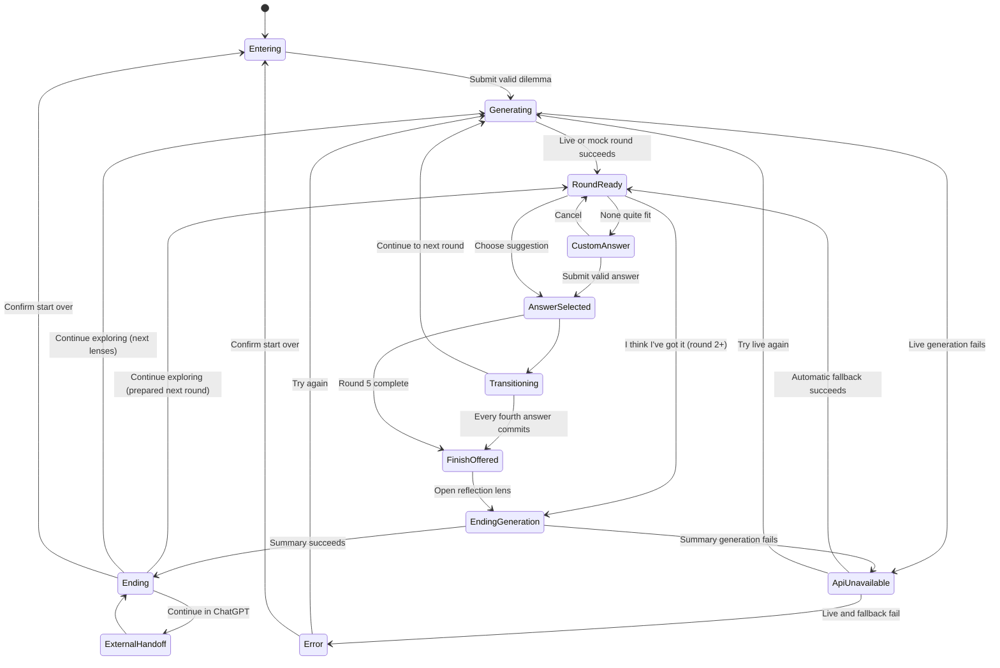

# Hmm… — Complete Session Experience Design

## Discovery-led round rhythm

The active neighbourhood begins with two violet question-lens cells carrying short theme labels, not a fully revealed question. Choosing a lens transforms that same cell into the active Hmm… question and reveals exactly three neighbouring answer cells. Until an answer is committed, **Try the other angle** restores both lenses without another content request. Once an answer is chosen, the unused lens clears back to the substrate and only the chosen question and answer remain marked.

Once an answer commits, its violet question and amber answer settle into one larger amber **decision cell**. It carries the user’s chosen answer, while the full question and all three original options remain preserved in semantic history. Its larger footprint makes nearby quiet cells yield through the controlled local-pressure layout. Activating a settled decision expands it into its original question plus three answers using their pre-merge treatments: the question regains its violet pin, full-question type, and active shell; the chosen answer regains its amber selected-suggestion treatment; the two discarded answers return as white possibilities. Activating the question or selected answer settles the same decision again. Choosing a discarded answer replaces that historical decision, removes every later decision from the path, updates the progress card, and resumes generation from the revised route. Only one trail step may be expanded at a time. Review never edits history except through this explicit replacement action, and never enables free pan or zoom.

Each active discovery places one small amber fortune-cookie cell near its two lenses. Opening it once reveals a short, surprising reframing grounded in the original dilemma and committed path. Cookies remain subordinate to lenses, never create connectors, and do not enter the progress card or committed AI history.

**Status:** Experience definition before implementation

**Depends on:** `docs/01-product-and-mvp.md`

**Purpose:** Specify the complete MVP journey, its states, its visual grammar, and the interaction rules that keep the experience expressive and legible.

## 1. Experience north star

The session should feel like a thought becoming visible.

The user begins with one unresolved dilemma. Hmm… introduces two useful question lenses; the selected lens opens into one question and three possible ways to respond. Each committed answer marks cells in a stable field and adds one short segment to a living path. The interface never displays every possible branch. It shows only the route the user is actually taking, clears unused content from the field, and gently recognizes when the route has produced enough clarity to pause.

The experience is not a chat transcript arranged in circles. It is a focused reflection with spatial memory: the active thought is unmistakable, the chosen path is still present, and everything else makes room.

### What the references contribute

The images in `references/` suggest several qualities worth carrying forward:

- softly irregular cells rather than perfect diagram circles;
- pale, breathable space with restrained violet luminosity;
- nodes that appear to press gently against a surrounding membrane;
- connectors that feel grown rather than mechanically routed;
- a clear visual change when a node becomes part of the chosen path;
- a final “settling” moment rather than an abrupt results page.

The MVP should not copy several elements shown in the references:

- no percentages, confidence scores, or implication that a decision can be calculated;
- no screen filled with meaningful nodes from edge to edge;
- no visible unchosen branches, plus buttons, or sprawling tree;
- no promise that sessions remain saved;
- no use of glow alone to distinguish node meaning.

The recommended direction is therefore a warm off-white cellular field with ink text, violet for Hmm… questions, amber for the user’s words, and neutral suggested answers. This field is not merely decorative background: it is the persistent interface substrate that receives content and records the selected route.

### Persistent field model

- The stage is a window onto a finite preset lattice of softly irregular cells that extends beyond the viewport; cell positions and identities remain stable for the session.
- The empty field reads as a packed “soup”: neighbouring cells appear to touch or nearly touch, so possibilities feel already present rather than spaced like a diagram. Packing is deterministic and precomputed in isotropic viewport-width world units—not a live physics simulation.
- Content occupancy uncovers questions and answers inside cells that were already part of that soup. The screen must not fill with edge-to-edge *meaningful* nodes; quiet empty cells remain subordinate substrate.
- A cell can be empty, hold active content, hold an unchosen suggestion, or retain a selected/previous mark. These are states of the same cell, not different layers of bubbles.
- Starting a new round does not create a new visible cluster. Content clears from unused cells, the next question and suggestions occupy the next preset cells, and the camera travels to that neighbourhood.
- A committed question-and-answer pair settles into one larger amber decision cell, carrying the selected text as part of the trail. Tapping it restores the two original cells for read-only review; the next commitment settles it again. A rejected cell loses its suggestion text and returns to its quiet neutral state.
- The active neighbourhood comes forward through scale, contrast, sharpness, halo, and a controlled camera pan. Recent cells remain near the viewport edge before slipping away; the progress card preserves the complete textual route.
- After a commitment, the next two question lenses occupy the two forward hex-neighbours that physically touch the settled decision. They are the immediate next possibilities in the same cellular field, not a detached cluster.
- Choosing an item under **Your thoughts** is a review affordance: the camera (or narrow scroll) focuses that settled amber decision and opens its read-only context directly beneath the progress card, but does **not** unfold it. Only tapping the settled decision itself restores its original question-and-answer pair, retaining that answer-slot focus while the pair separates. Neither action edits history or enables free pan/zoom. The next committed selection, a changed canonical trail, or **Back to now** returns focus to the active neighbourhood; harmless generation and transition phase changes do not cancel a requested review focus.
- While two new lenses are visible, their midpoint is the default camera target only. A chosen progress-card link always takes priority and moves the view to its exact historical cell.
- If a live Hmm… question is open with its three answers when a historical decision is unfolded, that live neighbourhood and its two associated text actions collapse from the canvas. The session retains it unchanged; settling the historical pair restores the same question, answers, and controls. This keeps exactly one expanded decision neighbourhood readable at a time.
- If the green reflection lens is currently offered, choosing a discarded historical answer removes that lens and truncates every later decision before the revised route resumes. At the fourth-round pause, the app reveals the next lenses for the revised route instead of immediately re-offering the stale reflection lens.
- The three suggestions form a compact fan in cells that physically touch the opened question; they must never read as a detached vertical menu. The fan follows the lens placement: an upper lens uses one cell directly above and two forward neighbours, while a lower lens uses one cell directly below and two forward neighbours. The selected position still determines the next route bend, so repeated choices create a distinct rising, level, falling, or mixed path.
- Semantic connectors join only selected relationships. Empty substrate cells never receive decorative cross-links.

## 2. Journey from arrival to ending

### 2.1 Landing and dilemma entry

The first screen opens directly on a compact, centred search-style writing surface, without a separate page header. It uses a small Hmm… wordmark, a clear prompt, and one generous but lightweight input rather than a giant cellular card. Once the session begins, the **Hmm…** wordmark lives inside the progress card rather than in a fixed top-left header:

> Clarify your next move

The user types a question or short description immediately. The cell grows within limits as text wraps. A character counter appears only near the limit.

The primary action is **Think it through**. It stays disabled until the input contains meaningful non-whitespace text. `Enter` submits when the field is a single line; `Shift+Enter` creates a new line. The user can also click the action.

After submission, the user’s wording becomes the permanent seed node for the session. It is never silently rewritten.

At the same moment, a compact progress card appears in a stable side area. Its prominent status bar starts with **Starting out**, while its details show the original dilemma. This card remains throughout exploration and the ending.

### 2.3 Generate the first turn

The landing search surface resolves directly into the persistent grid: the submitted thought becomes the amber seed node, the progress card appears, and the two first lens cells begin their textless violet preview. There is no separate loading page. The progress-card status carries the brief request state:

> Hmm… where’s the useful edge?

No fake progress percentage appears. The input is temporarily locked so the user cannot submit twice. If generation takes longer than about four seconds, the status changes to:

> Still with you…

### 2.4 Explore one round

The first Hmm… question resolves inside the dominant cell near the centre. Three nearby neutral cells receive suggestion content in fixed, non-overlapping positions. Their content enters in quick sequence, but all become available within roughly half a second; the underlying cells were already present.

The user can:

- select one suggested answer;
- choose **None quite fit** and write a brief answer;
- after round 2, choose **I think I’ve got it**;
- restart from a quiet menu action.

Selecting an answer is a commitment for this linear MVP. The occupied cell changes from a suggestion into a user-marked cell, receives a check mark, and becomes connected to the question. The two unchosen texts soften and dissolve while their cells return to the neutral field. The question and selected answer then draw together into a larger amber decision cell, and nearby quiet cells make room. The settled decision becomes the launch point for the next question in a nearby existing cell.

When the selection commits, the progress card appends that answer once under **Your thoughts** and updates its qualitative status. The card never updates on hover, focus, or the temporary pressed state. Each listed answer is activatable for trail review: activating it focuses the matching marked cell on the canvas without changing the session.

### 2.5 Progress through the path

Each new round repeats the same grammar:

1. current Hmm… question in violet;
2. three neutral suggestions plus the separate custom-answer action;
3. the occupied cell becomes amber and joins the path;
4. unused suggestion content disappears while the cells remain;
5. content occupies the next forward cells and the camera pans to keep the new question near the focal area;
6. older settled decisions remain marked in the world, even when they eventually move outside the viewport; activating one temporarily unfolds its original question and answer for review.

The route alternates between Hmm… and the user:

`user dilemma → Hmm… question → user answer → Hmm… question → user answer`

This alternating rhythm makes authorship readable even when the text is too small to scan.

### 2.6 Recognize enough clarity

After every fourth committed question/answer pair, the path grows one distinct **reflection lens** beside the last amber answer. It is one large sea-glass bubble with roughly the area of five normal cells: an organic shell governed by the same geometry and local-pressure rules as every other node, not a custom overlay or fixed four-cell shape. It says **What is taking shape?** and is an invitation, not a diagnosis. Nothing is summarised until the user taps it.

Its normal-sized sea-glass **Keep going** neighbour begins in the immediately adjacent cell. The local pressure pass then settles the pair membrane-to-membrane, letting the user decline the pause and reveal the already-prepared next pair of question lenses. It behaves like a fourth optional cell rather than a secondary text control. Opening the lens gathers and reveals the result; **Keep exploring** there offers the same return path. The persistent **I think I’ve got it** action remains available from round 2. At the fifth-round ceiling, a final **Let this settle** lens replaces automatic summary generation; tapping it explicitly opens the recap.

### 2.7 End the session

When the user finishes, the trail gently contracts toward one side while the summary is prepared. The transition copy is:

> Let me gather the thread…

The result arrives as one large, translucent “lens” that is visually distinct from every node. It contains four concise sections:

- what seems to be emerging;
- what is pulling the user there;
- what remains unresolved;
- one concrete next step.

The result remains framed as a reflection of the user’s path, never as the model’s verdict.

The ending actions are:

- **Continue in ChatGPT** — copies the prepared context and opens ChatGPT;
- **Continue exploring** — always present on a normal final reflection. It dismisses into a prepared next round when one exists; otherwise Hmm… directly generates the next two lenses from the committed path;
- **Start over** — asks for confirmation before clearing the current in-memory path.

An explicitly resumed question does not violate the soft ending: Hmm… has paused and will not continue without the user asking it to. Resuming always presents two app-generated lenses, never an input bubble. The future route limit remains a separate technical decision.

The progress card remains visible beside the result lens, changes its status to **A reflection is ready**, and preserves the exact ordered choices. It does not repeat the generated summary.

## 3. Required states

| State | What is visible | Available action | Exit condition |
| --- | --- | --- | --- |
| **Entering dilemma** | Wordmark, focused seed with text area and submit action | Type and submit | Valid submission starts generation |
| **Generation** | Persistent grid, submitted seed, progress card, two textless warming lens cells, short status | Wait; retry only after timeout | Valid response fills those lens cells; failure uses fallback or error state |
| **Active question** | One dominant violet occupied cell, marked trail, quiet cellular field, session controls | Read, choose an answer, finish when eligible | Answer selection or finish action |
| **Three possible answers** | Exactly three neutral cells holding suggestions around/below the question | Hover/focus, select, open custom answer | One suggestion is selected or custom input opens |
| **Different answer** | Suggestions remain visible but subdued; attached input cell or narrow-window sheet | Enter up to 160 characters, use answer, cancel | Valid custom text becomes the selected answer |
| **Selected answer** | One amber occupied cell with check mark; stronger connector to its question | None during the brief committed animation | Automatically enters transition |
| **Transition** | Chosen cells remain marked; unused text clears; focus moves as existing cells receive the next content | Wait | Next question becomes active, or a reflection lens appears |
| **Reflection lens** | One tappable violet bubble touching the latest amber answer | Open the reflection | Ending generation; or remain on the path until tapped |
| **Ending generation** | Entire path, dimmed but readable; gathering copy; forming result lens | Wait; retry after failure | Final result becomes available |
| **Ending** | Result lens, subdued full path, four-part reflection, contextual actions | Continue in ChatGPT, continue exploring, start over | External handoff, resumed path, one extra round, or reset |
| **API unavailable** | Existing context stays visible; calm inline recovery message; fallback begins automatically | Wait for demo path; try live again | Fallback succeeds, retry succeeds, or user restarts |
| **Unrecoverable error** | Existing path plus concise error card | Try again; start over; copy current path if any | Retry, reset, or manual preservation |

### State-specific interaction details

#### Persistent progress card

The progress card is a stable UI control, not a node and not a separate state. Its content is derived from the canonical dilemma, committed history, current phase, and ending signal.

When Hmm… is gathering the first turn, following a committed choice, or preparing the final reflection, this card—not the canvas—carries the loading motion. Its status bar uses a restrained moving violet wash and pulse; no large blurred, temporary, or end-of-journey thinking bubble is added to the cellular field.

During a route transition only, the two deterministic cells that will receive the next question lenses may quietly warm with a textless violet inner pulse. This is a spatial preview, not a second loading message: the progress-card banner remains the single source of loading copy, and the same two cells transform into the generated lenses once content arrives.

Content, in order:

- the **Hmm…** title;
- the original dilemma, unchanged and set larger than the detail labels;
- label: **Your thoughts**;
- an ordered list of committed answer text, using a small check marker; each item focuses its trail cell for review when activated;
- a prominent, live qualitative status bar;
- while reviewing a past cell, a quiet **Back to now** action restores the active neighbourhood focus.

Status rules:

| Condition | Status |
| --- | --- |
| Dilemma submitted, no committed answer | **Starting out** |
| One committed answer | **Exploring** |
| Two, three, or four committed answers without an ending signal | **Connecting the dots** |
| Four answers and `suggestEnding` is true | **A direction is forming** |
| A new round is loading | **Hmm… where’s the useful edge?** |
| A committed route is loading | The generated transition whisper, or **Following that thread…** |
| Summary generation is visible | **Let me gather the thread…** |
| Ending is visible | **A reflection is ready** |
| One user-requested extension is active | **Looking once more** |

These labels describe where the session is, not how certain the user is or how good the decision may be. The card must never show a certainty, confidence, clarity, completion, or probability score.

#### Writing a different answer

**None quite fit** is not rendered as a fourth answer cell. It is a small text action anchored below the three suggestions. Opening it produces a new user-coloured input cell connected with a dotted preview line to the active question.

Copy:

- label: **Say it your way**;
- placeholder: **What fits better?**;
- submit: **Use this answer**;
- cancel: **Back to the three**;
- limit: 160 characters;
- empty validation: **Give me a few words to follow.**

On desktop, this input cell grows in the least crowded side of the active cluster. In a narrow window, it appears as a bottom sheet above the keyboard. Submitting it uses exactly the same selected-answer and transition sequence as a suggested answer.

#### API unavailable

If live generation fails but mock content is available, begin loading the mock continuation automatically, keep the transition intact, and show a small, temporary notice:

> The connection went quiet. I’m switching to the demo path.

Action: **Try live again**. Otherwise, no response is required.

Technical error details never replace the user’s path. In diagnostic live mode, or if automatic fallback also fails, keep the progress card and selected trail visible and place a temporary error cell at the same focal slot reserved for the incoming question:

> I lost the thread for a moment. Your path is still here.

For retryable failures, a compact recovery panel sits beside the progress card, keeping the canvas and trail visible. It offers **Try again** and a quieter **Start over**. **Try again** repeats the exact failed operation with a new request ID; normal automatic mock fallback remains the reliable path whenever it is safe. For refusals or other non-retryable boundaries, show the boundary message and **Start over** only; never route sensitive content into generic mock reflection.

In development only, `?simulateError=timeout` and `?simulateError=refusal` deterministically exercise the two variants. These query parameters must be ignored in production builds.

## 4. Simple state machine

Implementation should derive the visible interface from one explicit session phase. “Active question,” “three possible answers,” and “selected answer” are visual substates of a round, not independent screens.

## 5. Visual language: who is speaking and what it means

Colour reinforces meaning but is never the only signal. Every semantic type also differs through label, scale, border, icon, or structure.

| Content type | Form and scale | Colour and border | Type and marker | Motion |
| --- | --- | --- | --- | --- |
| **User’s initial dilemma** | Large seed-shaped rounded cell; second only to the active question | Warm amber tint, solid amber edge | Small label **You brought**; exact user text; small seed mark | One initial breath, then stable |
| **Question from Hmm…** | Largest active circular/organic cell; double membrane | Pale violet fill, violet inner ring, soft outer halo | Small label **Hmm… asks**; question mark pin; medium-weight question text | Slow two-beat pulse while active |
| **Suggested answer** | Three existing medium cells hold content at equal visual weight | Warm white fill, thin neutral ink border | First-person text; no check mark; label exposed to assistive tech as **Possible answer** | Small lift on hover/focus; no ambient bobbing |
| **Selected answer** | Its cell grows 8–12% and joins the path without changing identity | Amber fill/edge replaces neutral styling | Small check mark; assistive label **Your answer** | Brief press, expand, connector draw |
| **Previous node** | The same selected cell reduces to 65–80% emphasis according to age | Original semantic hue desaturated; thinner halo | Text remains available; oldest labels may collapse visually but expand on focus/hover | Becomes still; no repeated animation |
| **Final result** | Large translucent lens/card, not a circle in the chain | Ink text on soft pearl surface; paired violet/amber rim | Label **What seems to be emerging** and four structured sections | Trail settles; lens clarifies from blur to sharp |

### Palette roles

- **Pearl / warm white:** canvas, neutral possibilities, breathing room.
- **Ink:** all primary text and structural contrast.
- **Violet:** Hmm… questions and generated observations.
- **Amber:** the user’s original and selected words.
- **Muted graphite:** previous connections and decorative membrane.
- **Soft coral:** recoverable error only; never used for unselected answers.

Green is intentionally avoided as the main selected/result colour because it commonly implies correctness. No semantic state relies on opacity or hue alone.

## 6. Visibility and fading rules

### Always visible during exploration

- the persistent cellular field, including quiet empty cells around the active neighbourhood;
- the active question;
- its three current suggestions;
- the separate **None quite fit** action;
- every selected question/answer pair as a continuous path of the actual semantic nodes;
- the initial dilemma as the first semantic node in that path on desktop;
- **I think I’ve got it** from round 2 onward;
- the progress card, containing the unchanged dilemma, every committed answer exactly once, and a prominent status bar such as **Connecting the dots**.

### What fades after selection

- the two unchosen suggestion texts begin fading only after the selected state is unmistakable;
- their content and interaction disappear completely before the next question becomes interactive, but their cell outlines remain;
- their connectors are removed with them and never remain as dead branches;
- the previous active question loses its glow but keeps its violet identity;
- older selected answers keep amber identity but become quieter.

### How the trail ages

- the immediately previous question and answer remain fully readable;
- nodes two rounds back reduce in scale and contrast but retain their text;
- on desktop, committed questions and answers never collapse into an abstract-only `?`/`✓` bead strip; their authored text and violet/amber identity remain visible;
- only the narrow-window overview may use labelled beads, and it supplements rather than replaces the vertical semantic thread;
- the path connector never drops below the contrast required to understand continuity;
- quiet empty cells never contain stale text and never compete with occupied or marked cells.

### At the ending

At the ending, the camera eases back enough to show a compact overview of the selected route where practical; it does not need to force every full-size cell into one viewport. The progress card remains available with **A reflection is ready** and the ordered choices. Both are subdued relative to the result lens, which receives primary focus. Unchosen suggestions are absent.

## 7. Complete four-round demo microcopy

### Welcome and input

**Wordmark:** Hmm…

**Invitation:** Clarify your next move

**Example:** For example: “Should I take a role that changes the kind of work I do?”

**Input label:** Your question or dilemma

**Entered text:** Would a new camera help me get back into photography?

**Primary action:** Think it through

**Progress status:** Starting out

### Initial generation

**Status:** Hmm… where’s the useful edge?

### Round 1 — surface the pull

**Hmm… asks:** What makes the role appealing right now?

**Possible answers:**

1. Having a camera ready.
2. Making time to shoot.
3. Knowing what to photograph.

**Alternative action:** None quite fit

**Selected:** Having a camera ready.

**Progress status:** Exploring

**Transition whisper:** So influence matters.

### Round 2 — surface the cost

**Hmm… asks:** What would make taking photos feel possible this week?

**Possible answers:**

1. A small outing.
2. A simple project.
3. A camera I enjoy using.

**Alternative action:** None quite fit

**Selected:** A camera I enjoy using.

**Progress status:** Connecting the dots

**Persistent finish action appears:** I think I’ve got it

**Transition whisper:** That sounds like more than a task preference.

### Round 3 — test a condition

**Hmm… asks:** When you picture your current camera, what gets in the way?

**Possible answers:**

1. It feels cumbersome.
2. It no longer inspires me.
3. I barely know where it is.

**Alternative action:** None quite fit

**Selected:** It no longer inspires me.

**Progress status:** Connecting the dots

**Transition whisper:** Hmm… then the role itself may not be the problem.

### Round 4 — make the uncertainty concrete

**Hmm… asks:** What would tell you whether new gear is the missing piece?

**Possible answers:**

1. Rent one for a weekend.
2. Borrow one for a walk.
3. Take mine out first.

**Alternative action:** None quite fit

**Selected:** Rent one for a weekend.

**Progress status:** A direction is forming

### Reflection lens

**Label:** Reflection lens

**Bubble copy:** What is taking shape?

**Action:** Tap the bubble to gather the recap. The result always includes **Continue exploring**: it either returns to a prepared fifth round or requests the next two Hmm… lenses directly.

### Ending generation

**Status:** Let me gather the thread…

### Ending

**Label:** What seems to be emerging

**Direction:** You seem to want a camera that lowers the friction of taking photos and rekindles your curiosity—not simply newer gear.

**What is pulling you there**

- Having a camera ready feels like a useful invitation to begin.
- You want the experience of using it to feel enjoyable again.
- A short real-world test matters more than comparing specifications.

**What is still unresolved**

- Whether a new camera is the real barrier, rather than time or habit.
- Which size and feel would genuinely make you carry it.

**One next step**

> Borrow or rent one camera for a weekend, then take one unplanned photo walk before deciding whether to buy.

**Actions:** Continue in ChatGPT · Explore one remaining doubt · Start over

**Handoff confirmation:** Context copied. Paste it into ChatGPT when the new tab opens.

**Progress status:** A reflection is ready

## 8. Motion specification

Motion carries state and causality. It should never exist merely to keep the canvas busy.

### Essential animations

1. **Seed opens (300–450 ms).** The welcome cell expands into the input surface. This preserves spatial continuity between invitation and dilemma.
2. **Generation pulse (900–1,200 ms loop).** Only the empty cell reserved for the incoming Hmm… question breathes while waiting. It stops as soon as content arrives.
3. **Content occupancy (350–550 ms).** The question sharpens inside its existing cell first; suggestion text and controls appear in three nearby cells with a 60–90 ms stagger. Cell geometry does not enter or exit.
4. **Selection commitment (450–650 ms).** The chosen answer depresses, grows 8–12%, changes to amber, gains a check, and pulls its connector into focus.
5. **Content clearing (250–350 ms).** Unchosen answer content fades only after the selection is clear; its cells settle back to neutral rather than leaving the field.
6. **Focus advance (600–850 ms).** The selected cell settles into the trail, the next connector draws, adjacent cells receive new content, and focus recentres on that existing neighbourhood.
7. **Clarity settling (500–700 ms).** Background movement and halos slow; the clarity card fades in without blocking the path.
8. **Result reveal (650–900 ms).** The trail compresses, the result lens moves from soft blur to sharp focus, and its four sections appear in reading order.

All content must remain usable if animation events fail. Under `prefers-reduced-motion`, replace scale, travel, blur, and looping pulses with short opacity changes of 100–180 ms; connectors appear rather than draw.

### Optional animations, only after P0 is stable

- a very slow background membrane drift with a movement range below 4 px;
- a slight organic border interpolation between two authored shapes;
- a tiny glint travelling once along a newly completed connector;
- a subtle local emphasis ripple across the existing cells as focus moves;
- a single violet/amber ripple when the result lens resolves;
- pointer parallax limited to the decorative background, never the text-bearing nodes.

Avoid continuous floating answers, liquid simulation, spring chains, particle clouds, cursor trails, or animation on every previous node.

## 9. Desktop and narrow-window behaviour

### Desktop and wide windows (about 900 px and above)

- Use a single full-height stage with generous safe margins.
- Reserve a stable 280–320 px upper-left area for the progress card; the semantic canvas must not render beneath it.
- Render one authored field whose cell centres remain fixed relative to one another throughout the session.
- Keep the active question close to the visual centre, not necessarily the geometric centre.
- Place answer suggestions in three reserved slots—upper right, right, and lower right—chosen to preserve reading order and prevent crossing connectors.
- Let the selected trail extend primarily leftward or in one shallow arc behind the active cluster.
- Pan forward across the finite field after each selection instead of adding a new cluster or shrinking everything to fit the whole history.
- Keep global actions at stable edges: finish action near the lower edge; the Hmm… brand lives in the progress card rather than in a fixed page header.
- On ending, keep the progress card and compact trail in the left third and place the result lens on the right two-thirds.

### Narrow windows (below about 900 px)

The experience uses an alternate authored view of the same logical cell slots rather than a squeezed radial diagram.

- A compact horizontal trail strip sits beneath the header and can scroll to the active end automatically.
- The progress card becomes a disclosure below the header: its prominent status row remains visible, its dilemma and answer list can expand, and it opens automatically at the ending.
- The active question occupies the full safe width below the strip.
- The three suggestions stack vertically in a fixed reading order with comfortable touch targets.
- Connectors become short vertical or gently curved segments and never cross.
- **None quite fit** stays below the three suggestions.
- The custom-answer editor opens as a bottom sheet above the software keyboard.
- **I think I’ve got it** remains a sticky but non-obscuring action near the bottom safe area from round 2.
- The ending uses a single column: result first, compact path second, actions last.

At no width should the layout simply scale the desktop canvas down. Body text remains at least 16 px, touch targets at least 44 px high, and the active question is never clipped by browser chrome or sticky controls.

## 10. Rules that prevent molecular spaghetti

1. **One path, not a tree.** Persist only chosen semantic content and marks. Clear unchosen content and connectors before advancing, without removing the underlying cells.
2. **One field, not accumulating clusters.** Render one stable set of cell slots. Never append a fresh question-and-answer molecule after a selection.
3. **One active neighbourhood.** Show at most one active question, three generated suggestions, and one separate custom-answer action.
4. **One edge per relationship.** Connect dilemma to question, question to selected answer, and selected answer to next question. No decorative cross-links.
5. **Never cross semantic connectors.** Use reserved placement slots and reframe the canvas instead of routing around collisions.
6. **Cap the automatic journey.** The core path contains no more than the dilemma plus five question/answer pairs before the ending.
7. **Compress history by age.** Preserve the route while reducing the scale, contrast, and label prominence of older marked cells.
8. **Separate occupancy from substrate.** Empty cells are faint, textless, non-interactive, and never connected to the semantic path; they are still the same cells later used for content.
9. **Use only six semantic treatments.** Dilemma, Hmm… question, suggested answer, selected answer, previous node, and result. Do not invent a new colour for each round.
10. **No numerical judgment.** Do not add confidence, completion, importance, or probability percentages to nodes.
11. **Keep text short at generation time.** Questions should normally fit within 90 characters; suggested answers within 40; custom answers within 160.
12. **Follow rather than fit.** The active thought stays readable while the camera advances through the persistent field. Do not continually zoom out or pull old cells back into the viewport.
13. **Motion has one owner.** During a transition, only the selected cell treatment, clearing content, connector, new content, and field focus may animate.
14. **Stop when the idea lands.** Slow the network and offer the ending when a coherent direction appears; do not populate cells merely to make the canvas look impressive.
15. **Keep the index outside the graph.** The progress card has no semantic connectors and never occupies a cell slot; it summarizes only committed history.

## Experience acceptance checks

- Without reading any text, a viewer can distinguish the current Hmm… question, the three neutral possibilities, and the user’s amber chosen path.
- A user can complete the curated four-round scenario, including the ending, without leaving the canvas or encountering an unexplained screen.
- A user whose answer is not represented can write a custom answer without creating a fourth competing suggestion node.
- At every round, the relationship between the current question and each answer is visible without crossed lines.
- The field exposes the same stable cell identities and geometry before and after a round transition; only occupancy, marks, connectors, and focus treatment change.
- Selecting an answer marks its existing cell, clears rejected content without removing those cells, and focuses an adjacent existing neighbourhood.
- Upper, middle, and lower selection sequences generate predictably different routes, and the camera follows each route away from the origin.
- After four rounds, the initial dilemma and complete selected route remain identifiable, but the active content still dominates.
- After every committed answer, the progress card matches the trail exactly and never includes an unchosen suggestion.
- The status label is derived from session phase and ending signal; no numeric certainty or decision-quality score appears.
- Live-generation failure preserves the user’s path and continues automatically with mock content.
- Reduced-motion mode conveys every state change without relying on travel, pulsing, blur, or morphing.
- At narrow widths, the three answers remain readable and tappable, the active question is not clipped, and the path becomes a compact thread rather than a miniature canvas.
