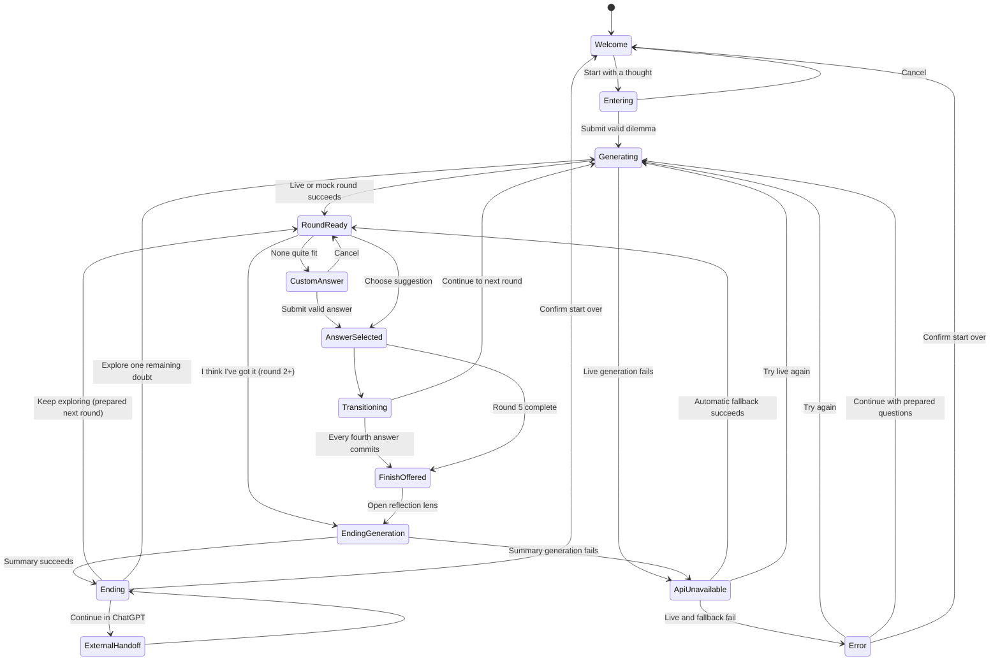

# Hmm… — Complete Session Experience Design

## Discovery-led round rhythm

The active neighbourhood begins with two violet question-lens cells carrying short theme labels, not a fully revealed question. Choosing a lens transforms that same cell into the active Hmm… question and reveals exactly three neighbouring answer cells. Until an answer is committed, **Try the other angle** restores both lenses without another content request. Once an answer is chosen, the unused lens clears back to the substrate and only the chosen question and answer remain marked.

Committed question and answer cells are buttons in review mode. Activating either focuses that cell and opens one read-only trail card containing the lens theme, full question, and chosen answer. **Back to now** or Escape restores the current neighbourhood. Review never edits history, resurrects an unused lens, or enables free pan and zoom.

Each active discovery places one small amber fortune-cookie cell near its two lenses. Opening it once reveals a short, surprising reframing grounded in the original dilemma and committed path. Cookies remain subordinate to lenses, never create connectors, and do not enter the progress card or committed AI history.

**Status:** Experience definition before implementation

**Depends on:** `docs/01-product-and-mvp.md`

**Purpose:** Specify the complete MVP journey, its states, its visual grammar, and the interaction rules that keep the experience expressive and legible.

## 1. Experience north star

The session should feel like a thought becoming visible.

The user begins with one unresolved dilemma. Hmm… introduces two useful question lenses; the selected lens opens into one question and three possible ways to respond. Each committed answer marks cells in a stable field and adds one short segment to a living path. The interface never displays every possible branch. It shows only the route the user is actually taking, clears unused content from the field, and gently recognizes when the route has produced enough clarity to pause.

The experience is not a chat transcript arranged in circles. It is a focused reflection with spatial memory: the active thought is unmistakable, the chosen path is still present, and everything else makes room.

### What the references contribute

The images in `references/` suggest several qualities worth carrying forward:

- softly irregular cells rather than perfect diagram circles;
- pale, breathable space with restrained violet luminosity;
- nodes that appear to press gently against a surrounding membrane;
- connectors that feel grown rather than mechanically routed;
- a clear visual change when a node becomes part of the chosen path;
- a final “settling” moment rather than an abrupt results page.

The MVP should not copy several elements shown in the references:

- no percentages, confidence scores, or implication that a decision can be calculated;
- no screen filled with meaningful nodes from edge to edge;
- no visible unchosen branches, plus buttons, or sprawling tree;
- no promise that sessions remain saved;
- no use of glow alone to distinguish node meaning.

The recommended direction is therefore a warm off-white cellular field with ink text, violet for Hmm… questions, amber for the user’s words, and neutral suggested answers. This field is not merely decorative background: it is the persistent interface substrate that receives content and records the selected route.

### Persistent field model

- The stage is a window onto a finite preset lattice of softly irregular cells that extends beyond the viewport; cell positions and identities remain stable for the session.
- The empty field reads as a packed “soup”: neighbouring cells appear to touch or nearly touch, so possibilities feel already present rather than spaced like a diagram. Packing is deterministic and precomputed in isotropic viewport-width world units—not a live physics simulation.
- Content occupancy uncovers questions and answers inside cells that were already part of that soup. The screen must not fill with edge-to-edge *meaningful* nodes; quiet empty cells remain subordinate substrate.
- A cell can be empty, hold active content, hold an unchosen suggestion, or retain a selected/previous mark. These are states of the same cell, not different layers of bubbles.
- Starting a new round does not create a new visible cluster. Content clears from unused cells, the next question and suggestions occupy the next preset cells, and the camera travels to that neighbourhood.
- A selected cell keeps its amber mark and selected text as part of the trail. A rejected cell loses its suggestion text and returns to its quiet neutral state.
- The active neighbourhood comes forward through scale, contrast, sharpness, halo, and a controlled camera pan. Recent cells remain near the viewport edge before slipping away; the progress card preserves the complete textual route.
- Choosing an item under **What you’ve chosen so far** is a review affordance: the camera (or narrow scroll) briefly focuses that committed amber answer cell. It does not edit history or enable free pan/zoom. The next selection, phase change, or **Back to now** returns focus to the active neighbourhood.
- The three suggestions form a compact fan in cells that physically touch the opened question; they must never read as a detached vertical menu. The fan follows the lens placement: an upper lens uses one cell directly above and two forward neighbours, while a lower lens uses one cell directly below and two forward neighbours. The selected position still determines the next route bend, so repeated choices create a distinct rising, level, falling, or mixed path.
- Semantic connectors join only selected relationships. Empty substrate cells never receive decorative cross-links.

## 2. Journey from arrival to ending

### 2.1 Welcome

The first screen is quiet and nearly empty. A small **Hmm…** wordmark sits above a soft seed cell. The seed has a slow, almost imperceptible breathing motion and contains the invitation:

> What are you thinking through?

A short supporting line sets expectations:

> Bring one question. We’ll follow it for a few turns.

The only prominent action is **Start with a thought**. An example sits beneath it as low-emphasis text, not as a second call to action.

### 2.2 Enter the dilemma

Activating the seed expands it into a focused writing surface rather than opening a separate form page. The user types a question or short description. The cell grows within limits as text wraps. A character counter appears only near the limit.

The primary action is **Think it through**. It stays disabled until the input contains meaningful non-whitespace text. `Enter` submits when the field is a single line; `Shift+Enter` creates a new line. The user can also click the action.

After submission, the user’s wording becomes the permanent seed node for the session. It is never silently rewritten.

At the same moment, a compact card titled **Your thread** appears in a stable side area. It shows the original dilemma and starts with **0 of up to 5 · Starting out**. This card remains throughout exploration and the ending.

### 2.3 Generate the first turn

The seed contracts slightly and focus shifts toward a nearby empty cell. A fine connector grows toward its violet inner outline. Inside it, a short status cycles no more than once:

> Hmm… where’s the useful edge?

No fake progress percentage appears. The input is temporarily locked so the user cannot submit twice. If generation takes longer than about four seconds, the status changes to:

> Still with you…

### 2.4 Explore one round

The first Hmm… question resolves inside the dominant cell near the centre. Three nearby neutral cells receive suggestion content in fixed, non-overlapping positions. Their content enters in quick sequence, but all become available within roughly half a second; the underlying cells were already present.

The user can:

- select one suggested answer;
- choose **None quite fit** and write a brief answer;
- after round 2, choose **I think I’ve got it**;
- restart from a quiet menu action.

Selecting an answer is a commitment for this linear MVP. The occupied cell changes from a suggestion into a user-marked cell, receives a check mark, and becomes connected to the question. The two unchosen texts soften and dissolve while their cells return to the neutral field. The selected cell then becomes the launch point for the next question in a nearby existing cell.

When the selection commits, the progress card appends that answer once under **What you’ve chosen so far** and updates its round/status line. The card never updates on hover, focus, or the temporary pressed state. Each listed answer is activatable for trail review: activating it focuses the matching marked cell on the canvas without changing the session.

### 2.5 Progress through the path

Each new round repeats the same grammar:

1. current Hmm… question in violet;
2. three neutral suggestions plus the separate custom-answer action;
3. the occupied cell becomes amber and joins the path;
4. unused suggestion content disappears while the cells remain;
5. content occupies the next forward cells and the camera pans to keep the new question near the focal area;
6. older selected cells remain marked in the world, even when they eventually move outside the viewport.

The route alternates between Hmm… and the user:

`user dilemma → Hmm… question → user answer → Hmm… question → user answer`

This alternating rhythm makes authorship readable even when the text is too small to scan.

### 2.6 Recognize enough clarity

After every fourth committed question/answer pair, the path grows one distinct **reflection lens** beside the last amber answer. It is anchored over exactly four quiet cells in the packed lattice: one left, two vertically stacked in the middle, and one right. Its translucent sea-glass membrane uses that precise diamond footprint, letting the existing cellular soup supply the subtle internal arcs. There are no decorative internal lines. This is a layer over the field, not a replacement bubble. It says **What is taking shape?** and is an invitation, not a diagnosis. Nothing is summarised until the user taps it.

Below it, a normal-sized sea-glass **Keep going** bubble lets the user decline the pause immediately and reveal the already-prepared next pair of question lenses. It behaves like a fourth optional cell rather than a secondary text control. Opening the lens gathers and reveals the result; **Keep exploring** there offers the same return path. The persistent **I think I’ve got it** action remains available from round 2. At the fifth-round ceiling, a final **Let this settle** lens replaces automatic summary generation; tapping it explicitly opens the recap.

### 2.7 End the session

When the user finishes, the trail gently contracts toward one side while the summary is prepared. The transition copy is:

> Let me gather the thread…

The result arrives as one large, translucent “lens” that is visually distinct from every node. It contains four concise sections:

- what seems to be emerging;
- what is pulling the user there;
- what remains unresolved;
- one concrete next step.

The result remains framed as a reflection of the user’s path, never as the model’s verdict.

The ending actions are:

- **Continue in ChatGPT** — copies the prepared context and opens ChatGPT;
- **Keep exploring** — only when the next round was prepared before the recap; dismisses the result and returns to those lenses without rewriting history;
- **Explore one remaining doubt** — when no prepared core round remains and fewer than five answers have been committed, adds exactly one user-initiated question and then returns to an updated ending;
- **Start over** — asks for confirmation before clearing the current in-memory path.

An explicitly resumed question does not violate the five-round automatic stop: Hmm… has already paused and will not continue without the user asking it to.

The progress card remains visible beside the result lens, changes its status to **Ready to reflect**, and preserves the exact ordered choices. It does not repeat the generated summary.

## 3. Required states

| State | What is visible | Available action | Exit condition |
| --- | --- | --- | --- |
| **Welcome** | Wordmark, empty seed cell, invitation, one-line promise, example | Start with a thought | Opens the input state |
| **Entering dilemma** | Expanded seed with text area, submit action, quiet cancel action | Type, submit, cancel | Valid submission starts generation |
| **Generation** | Submitted seed, growing connector, one empty/pulsing violet cell, short status | Wait; retry only after timeout | Valid response fills the active cells; failure uses fallback or error state |
| **Active question** | One dominant violet occupied cell, marked trail, quiet cellular field, session controls | Read, choose an answer, finish when eligible | Answer selection or finish action |
| **Three possible answers** | Exactly three neutral cells holding suggestions around/below the question | Hover/focus, select, open custom answer | One suggestion is selected or custom input opens |
| **Different answer** | Suggestions remain visible but subdued; attached input cell or narrow-window sheet | Enter up to 160 characters, use answer, cancel | Valid custom text becomes the selected answer |
| **Selected answer** | One amber occupied cell with check mark; stronger connector to its question | None during the brief committed animation | Automatically enters transition |
| **Transition** | Chosen cells remain marked; unused text clears; focus moves as existing cells receive the next content | Wait | Next question becomes active, or a reflection lens appears |
| **Reflection lens** | One tappable violet bubble touching the latest amber answer | See what’s emerging | Ending generation; or remain on the path until tapped |
| **Ending generation** | Entire path, dimmed but readable; gathering copy; forming result lens | Wait; retry after failure | Final result becomes available |
| **Ending** | Result lens, subdued full path, four-part reflection, contextual actions | Continue in ChatGPT, keep exploring when available, explore one doubt, start over | External handoff, resumed path, one extra round, or reset |
| **API unavailable** | Existing context stays visible; calm inline recovery message; fallback begins automatically | Wait for demo path; try live again | Fallback succeeds, retry succeeds, or user restarts |
| **Unrecoverable error** | Existing path plus concise error card | Try again; start over; copy current path if any | Retry, reset, or manual preservation |

### State-specific interaction details

#### Persistent progress card

The progress card is a stable UI control, not a node and not a separate state. Its content is derived from the canonical dilemma, committed history, current phase, and ending signal.

Content:

- heading: **Your thread**;
- label: **You’re thinking through**;
- the original dilemma, unchanged;
- label: **What you’ve chosen so far**;
- an ordered list of committed answer text, using a small check marker; each item focuses its trail cell for review when activated;
- a factual round count: **{completed} of up to 5**;
- one qualitative session status;
- while reviewing a past cell, a quiet **Back to now** action restores the active neighbourhood focus.

Status rules:

| Condition | Status |
| --- | --- |
| Dilemma submitted, no committed answer | **Starting out** |
| One committed answer | **Exploring** |
| Two, three, or four committed answers without an ending signal | **Connecting the dots** |
| Four answers and `suggestEnding` is true | **A direction is forming** |
| Ending or summary is visible | **Ready to reflect** |
| One user-requested extension is active | **Looking once more** |

These labels describe where the session is, not how certain the user is or how good the decision may be. The card must never show a certainty, confidence, clarity, completion, or probability score.

#### Writing a different answer

**None quite fit** is not rendered as a fourth answer cell. It is a small text action anchored below the three suggestions. Opening it produces a new user-coloured input cell connected with a dotted preview line to the active question.

Copy:

- label: **Say it your way**;
- placeholder: **What fits better?**;
- submit: **Use this answer**;
- cancel: **Back to the three**;
- limit: 160 characters;
- empty validation: **Give me a few words to follow.**

On desktop, this input cell grows in the least crowded side of the active cluster. In a narrow window, it appears as a bottom sheet above the keyboard. Submitting it uses exactly the same selected-answer and transition sequence as a suggested answer.

#### API unavailable

If live generation fails but mock content is available, begin loading the mock continuation automatically, keep the transition intact, and show a small, temporary notice:

> The connection went quiet. I’m switching to the demo path.

Action: **Try live again**. Otherwise, no response is required.

Technical error details never replace the user’s path. In diagnostic live mode, or if automatic fallback also fails, keep the progress card and selected trail visible and place a temporary error cell at the same focal slot reserved for the incoming question:

> I lost the thread for a moment. Your path is still here.

For retryable failures with a valid mock continuation, actions are **Try again**, **Continue with prepared questions**, and a quieter **Start over**. **Try again** repeats the exact failed operation with a new request ID. **Continue with prepared questions** runs that operation through the mock provider without changing committed history. For refusals or other non-retryable boundaries, show the boundary message and **Start over** only; never route sensitive content into generic mock reflection.

In development only, `?simulateError=timeout` and `?simulateError=refusal` deterministically exercise the two variants. These query parameters must be ignored in production builds.

## 4. Simple state machine

Implementation should derive the visible interface from one explicit session phase. “Active question,” “three possible answers,” and “selected answer” are visual substates of a round, not independent screens.

## 5. Visual language: who is speaking and what it means

Colour reinforces meaning but is never the only signal. Every semantic type also differs through label, scale, border, icon, or structure.

| Content type | Form and scale | Colour and border | Type and marker | Motion |
| --- | --- | --- | --- | --- |
| **User’s initial dilemma** | Large seed-shaped rounded cell; second only to the active question | Warm amber tint, solid amber edge | Small label **You brought**; exact user text; small seed mark | One initial breath, then stable |
| **Question from Hmm…** | Largest active circular/organic cell; double membrane | Pale violet fill, violet inner ring, soft outer halo | Small label **Hmm… asks**; question mark pin; medium-weight question text | Slow two-beat pulse while active |
| **Suggested answer** | Three existing medium cells hold content at equal visual weight | Warm white fill, thin neutral ink border | First-person text; no check mark; label exposed to assistive tech as **Possible answer** | Small lift on hover/focus; no ambient bobbing |
| **Selected answer** | Its cell grows 8–12% and joins the path without changing identity | Amber fill/edge replaces neutral styling | Small check mark; assistive label **Your answer** | Brief press, expand, connector draw |
| **Previous node** | The same selected cell reduces to 65–80% emphasis according to age | Original semantic hue desaturated; thinner halo | Text remains available; oldest labels may collapse visually but expand on focus/hover | Becomes still; no repeated animation |
| **Final result** | Large translucent lens/card, not a circle in the chain | Ink text on soft pearl surface; paired violet/amber rim | Label **What seems to be emerging** and four structured sections | Trail settles; lens clarifies from blur to sharp |

### Palette roles

- **Pearl / warm white:** canvas, neutral possibilities, breathing room.
- **Ink:** all primary text and structural contrast.
- **Violet:** Hmm… questions and generated observations.
- **Amber:** the user’s original and selected words.
- **Muted graphite:** previous connections and decorative membrane.
- **Soft coral:** recoverable error only; never used for unselected answers.

Green is intentionally avoided as the main selected/result colour because it commonly implies correctness. No semantic state relies on opacity or hue alone.

## 6. Visibility and fading rules

### Always visible during exploration

- the persistent cellular field, including quiet empty cells around the active neighbourhood;
- the active question;
- its three current suggestions;
- the separate **None quite fit** action;
- every selected question/answer pair as a continuous path of the actual semantic nodes;
- the initial dilemma as the first semantic node in that path on desktop;
- **I think I’ve got it** from round 2 onward;
- the **Your thread** progress card, containing the unchanged dilemma, every committed answer exactly once, and a quiet round/status line such as **2 of up to 5 · Connecting the dots**.

### What fades after selection

- the two unchosen suggestion texts begin fading only after the selected state is unmistakable;
- their content and interaction disappear completely before the next question becomes interactive, but their cell outlines remain;
- their connectors are removed with them and never remain as dead branches;
- the previous active question loses its glow but keeps its violet identity;
- older selected answers keep amber identity but become quieter.

### How the trail ages

- the immediately previous question and answer remain fully readable;
- nodes two rounds back reduce in scale and contrast but retain their text;
- on desktop, committed questions and answers never collapse into an abstract-only `?`/`✓` bead strip; their authored text and violet/amber identity remain visible;
- only the narrow-window overview may use labelled beads, and it supplements rather than replaces the vertical semantic thread;
- the path connector never drops below the contrast required to understand continuity;
- quiet empty cells never contain stale text and never compete with occupied or marked cells.

### At the ending

At the ending, the camera eases back enough to show a compact overview of the selected route where practical; it does not need to force every full-size cell into one viewport. The progress card remains available with **Ready to reflect** and the ordered choices. Both are subdued relative to the result lens, which receives primary focus. Unchosen suggestions are absent.

## 7. Complete four-round demo microcopy

### Welcome and input

**Wordmark:** Hmm…

**Invitation:** What are you thinking through?

**Support:** Bring one question. We’ll follow it for a few turns.

**Example:** For example: “Should I take a role that changes the kind of work I do?”

**Input label:** Your question or dilemma

**Entered text:** Should I accept a team-lead role if it means less hands-on creative work?

**Primary action:** Think it through

**Progress card:** Your thread · 0 of up to 5 · Starting out

### Initial generation

**Status:** Hmm… where’s the useful edge?

### Round 1 — surface the pull

**Hmm… asks:** What makes the role appealing right now?

**Possible answers:**

1. I want more influence.
2. I’m ready to grow.
3. The recognition matters.

**Alternative action:** None quite fit

**Selected:** I want more influence.

**Progress card:** 1 of up to 5 · Exploring · I want more influence

**Transition whisper:** So influence matters.

### Round 2 — surface the cost

**Hmm… asks:** What are you most reluctant to give up?

**Possible answers:**

1. Making things myself.
2. Control of my time.
3. Being close to the work.

**Alternative action:** None quite fit

**Selected:** Making things myself.

**Progress card:** 2 of up to 5 · Connecting the dots · I want more influence · Making things myself

**Persistent finish action appears:** I think I’ve got it

**Transition whisper:** That sounds like more than a task preference.

### Round 3 — test a condition

**Hmm… asks:** If hands-on work were protected, how would the role feel?

**Possible answers:**

1. Much more appealing.
2. Still too managerial.
3. I’m not sure yet.

**Alternative action:** None quite fit

**Selected:** Much more appealing.

**Progress card:** 3 of up to 5 · Connecting the dots · I want more influence · Making things myself · Much more appealing

**Transition whisper:** Hmm… then the role itself may not be the problem.

### Round 4 — make the uncertainty concrete

**Hmm… asks:** What would you need to know before saying yes?

**Possible answers:**

1. Whether the role is flexible.
2. How success is measured.
3. Who would support me.

**Alternative action:** None quite fit

**Selected:** Whether the role is flexible.

**Progress card:** 4 of up to 5 · A direction is forming · I want more influence · Making things myself · Much more appealing · Whether the role is flexible

### Reflection lens

**Label:** Reflection lens

**Bubble copy:** What is taking shape?

**Action:** Tap the bubble to gather the recap. If a fifth round is prepared, the result includes **Keep exploring** to dismiss it and return to that round.

### Ending generation

**Status:** Let me gather the thread…

### Ending

**Label:** What seems to be emerging

**Direction:** You seem open to the team-lead role—if it can preserve meaningful hands-on work.

**What is pulling you there**

- You want broader influence.
- Making things yourself is an important part of work you value.
- The role feels more appealing when creative time is protected.

**What is still unresolved**

- Whether the role is genuinely flexible in practice.
- How much hands-on time can realistically be protected.

**One next step**

> Ask the hiring manager: “Could we shape this role so I keep one protected day each week for hands-on work?”

**Actions:** Continue in ChatGPT · Explore one remaining doubt · Start over

**Handoff confirmation:** Context copied. Paste it into ChatGPT when the new tab opens.

**Progress card:** 4 of up to 5 · Ready to reflect · I want more influence · Making things myself · Much more appealing · Whether the role is flexible

## 8. Motion specification

Motion carries state and causality. It should never exist merely to keep the canvas busy.

### Essential animations

1. **Seed opens (300–450 ms).** The welcome cell expands into the input surface. This preserves spatial continuity between invitation and dilemma.
2. **Generation pulse (900–1,200 ms loop).** Only the empty cell reserved for the incoming Hmm… question breathes while waiting. It stops as soon as content arrives.
3. **Content occupancy (350–550 ms).** The question sharpens inside its existing cell first; suggestion text and controls appear in three nearby cells with a 60–90 ms stagger. Cell geometry does not enter or exit.
4. **Selection commitment (450–650 ms).** The chosen answer depresses, grows 8–12%, changes to amber, gains a check, and pulls its connector into focus.
5. **Content clearing (250–350 ms).** Unchosen answer content fades only after the selection is clear; its cells settle back to neutral rather than leaving the field.
6. **Focus advance (600–850 ms).** The selected cell settles into the trail, the next connector draws, adjacent cells receive new content, and focus recentres on that existing neighbourhood.
7. **Clarity settling (500–700 ms).** Background movement and halos slow; the clarity card fades in without blocking the path.
8. **Result reveal (650–900 ms).** The trail compresses, the result lens moves from soft blur to sharp focus, and its four sections appear in reading order.

All content must remain usable if animation events fail. Under `prefers-reduced-motion`, replace scale, travel, blur, and looping pulses with short opacity changes of 100–180 ms; connectors appear rather than draw.

### Optional animations, only after P0 is stable

- a very slow background membrane drift with a movement range below 4 px;
- a slight organic border interpolation between two authored shapes;
- a tiny glint travelling once along a newly completed connector;
- a subtle local emphasis ripple across the existing cells as focus moves;
- a single violet/amber ripple when the result lens resolves;
- pointer parallax limited to the decorative background, never the text-bearing nodes.

Avoid continuous floating answers, liquid simulation, spring chains, particle clouds, cursor trails, or animation on every previous node.

## 9. Desktop and narrow-window behaviour

### Desktop and wide windows (about 900 px and above)

- Use a single full-height stage with generous safe margins.
- Reserve a stable 280–320 px upper-left area for **Your thread**; the semantic canvas must not render beneath it.
- Render one authored field whose cell centres remain fixed relative to one another throughout the session.
- Keep the active question close to the visual centre, not necessarily the geometric centre.
- Place answer suggestions in three reserved slots—upper right, right, and lower right—chosen to preserve reading order and prevent crossing connectors.
- Let the selected trail extend primarily leftward or in one shallow arc behind the active cluster.
- Pan forward across the finite field after each selection instead of adding a new cluster or shrinking everything to fit the whole history.
- Keep global actions at stable edges: wordmark/restart at the top and finish action near the lower edge.
- On ending, keep **Your thread** and the compact trail in the left third and place the result lens on the right two-thirds.

### Narrow windows (below about 900 px)

The experience uses an alternate authored view of the same logical cell slots rather than a squeezed radial diagram.

- A compact horizontal trail strip sits beneath the header and can scroll to the active end automatically.
- **Your thread** becomes a disclosure below the header: its status row remains visible, its dilemma and answer list can expand, and it opens automatically at the ending.
- The active question occupies the full safe width below the strip.
- The three suggestions stack vertically in a fixed reading order with comfortable touch targets.
- Connectors become short vertical or gently curved segments and never cross.
- **None quite fit** stays below the three suggestions.
- The custom-answer editor opens as a bottom sheet above the software keyboard.
- **I think I’ve got it** remains a sticky but non-obscuring action near the bottom safe area from round 2.
- The ending uses a single column: result first, compact path second, actions last.

At no width should the layout simply scale the desktop canvas down. Body text remains at least 16 px, touch targets at least 44 px high, and the active question is never clipped by browser chrome or sticky controls.

## 10. Rules that prevent molecular spaghetti

1. **One path, not a tree.** Persist only chosen semantic content and marks. Clear unchosen content and connectors before advancing, without removing the underlying cells.
2. **One field, not accumulating clusters.** Render one stable set of cell slots. Never append a fresh question-and-answer molecule after a selection.
3. **One active neighbourhood.** Show at most one active question, three generated suggestions, and one separate custom-answer action.
4. **One edge per relationship.** Connect dilemma to question, question to selected answer, and selected answer to next question. No decorative cross-links.
5. **Never cross semantic connectors.** Use reserved placement slots and reframe the canvas instead of routing around collisions.
6. **Cap the automatic journey.** The core path contains no more than the dilemma plus five question/answer pairs before the ending.
7. **Compress history by age.** Preserve the route while reducing the scale, contrast, and label prominence of older marked cells.
8. **Separate occupancy from substrate.** Empty cells are faint, textless, non-interactive, and never connected to the semantic path; they are still the same cells later used for content.
9. **Use only six semantic treatments.** Dilemma, Hmm… question, suggested answer, selected answer, previous node, and result. Do not invent a new colour for each round.
10. **No numerical judgment.** Do not add confidence, completion, importance, or probability percentages to nodes.
11. **Keep text short at generation time.** Questions should normally fit within 90 characters; suggested answers within 40; custom answers within 160.
12. **Follow rather than fit.** The active thought stays readable while the camera advances through the persistent field. Do not continually zoom out or pull old cells back into the viewport.
13. **Motion has one owner.** During a transition, only the selected cell treatment, clearing content, connector, new content, and field focus may animate.
14. **Stop when the idea lands.** Slow the network and offer the ending when a coherent direction appears; do not populate cells merely to make the canvas look impressive.
15. **Keep the index outside the graph.** The progress card has no semantic connectors and never occupies a cell slot; it summarizes only committed history.

## Experience acceptance checks

- Without reading any text, a viewer can distinguish the current Hmm… question, the three neutral possibilities, and the user’s amber chosen path.
- A user can complete the curated four-round scenario, including the ending, without leaving the canvas or encountering an unexplained screen.
- A user whose answer is not represented can write a custom answer without creating a fourth competing suggestion node.
- At every round, the relationship between the current question and each answer is visible without crossed lines.
- The field exposes the same stable cell identities and geometry before and after a round transition; only occupancy, marks, connectors, and focus treatment change.
- Selecting an answer marks its existing cell, clears rejected content without removing those cells, and focuses an adjacent existing neighbourhood.
- Upper, middle, and lower selection sequences generate predictably different routes, and the camera follows each route away from the origin.
- After four rounds, the initial dilemma and complete selected route remain identifiable, but the active content still dominates.
- After every committed answer, **Your thread** matches the trail exactly and never includes an unchosen suggestion.
- The status label is derived from session phase and ending signal; no numeric certainty or decision-quality score appears.
- Live-generation failure preserves the user’s path and continues automatically with mock content.
- Reduced-motion mode conveys every state change without relying on travel, pulsing, blur, or morphing.
- At narrow widths, the three answers remain readable and tappable, the active question is not clipped, and the path becomes a compact thread rather than a miniature canvas.
