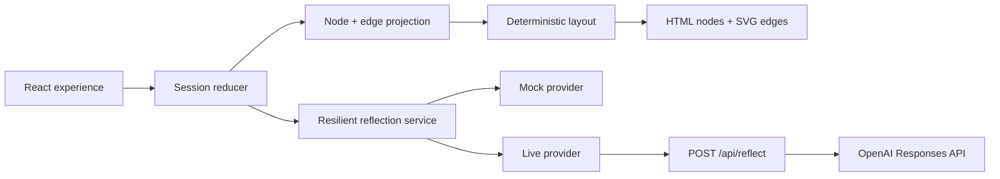

# Hmm… — Technical Design

**Status:** Implementation-ready architecture proposal

**Depends on:** `docs/01-product-and-mvp.md`, `docs/02-experience-design.md`, and `docs/04-ai-contract.md`

**Goal:** Deliver the complete hackathon experience with strong visual quality in two days, without building a general graph editor, a physics simulation, or a persistent backend.

## Architecture decision in one sentence

Build a single React/Vite application whose session is managed by one reducer, render accessible HTML nodes at deterministic coordinates over one SVG connection layer, animate controlled state transitions with Motion, and obtain validated reflection content through one Vercel Function with an automatic local mock fallback.



The semantic session—not the canvas—is the source of truth. Nodes, edges, positions, and animations are derived views of that session.

## 1. Specific technology stack

| Layer | Choice | Why this is the smallest suitable option |
| --- | --- | --- |
| Client | React + TypeScript + Vite | Matches the agreed stack, gives rapid component iteration, and keeps the app a simple client-side experience. |
| State | React `useReducer` plus Context | The state is one bounded session with explicit phases. Redux, Zustand, and a state-machine package would add setup without solving a hard problem here. |
| Styling | Plain CSS files, CSS custom properties, and semantic class names | The organic visual treatment needs bespoke shapes, layers, blur, and responsive rules. A utility framework would not remove meaningful work. |
| Nodes | Absolutely positioned HTML buttons/articles | Preserves native text wrapping, focus, keyboard behavior, and screen-reader semantics while allowing art-directed placement. |
| Connections | One non-interactive SVG layer behind the HTML nodes | SVG paths are easy to draw, fade, and animate while node content remains accessible HTML. |
| Animation | Motion for React (`motion`) for presence and positional transitions; CSS for simple halos | Motion provides layout transforms, exit sequencing, and reduced-motion support without introducing a full scene or physics engine. Its documented `AnimatePresence` and layout animations match the node promotion and pruning behavior required here. |
| Validation | Zod in a root `shared/` module | One schema can validate browser requests, server input, model output, and mock fixtures. Tuple schemas enforce exactly three answers. |
| AI server | One TypeScript Vercel Function in `api/reflect.ts` | Vercel supports Vite projects with functions in an `api` directory, so the frontend and secret-bearing endpoint can deploy together without a separate server. |
| Model API | Official OpenAI JavaScript SDK, Responses API, and Structured Outputs | The SDK can parse a response directly against a Zod schema. Structured Outputs provides schema adherence rather than merely valid JSON. |
| Default model | `gpt-5.6-terra`, configurable with `OPENAI_MODEL` | Current official guidance describes Terra as the balance of intelligence and cost. Use low reasoning effort for this short, latency-sensitive task; keep the model configurable so the contract is not coupled to one release. |
| Tests | Vitest for reducer, schema, layout, and mock-provider tests | These are the failure-prone pure functions. A full end-to-end suite is not necessary for the two-day prototype. |
| Deployment | Vercel | One static frontend plus one same-repository function is the shortest path to a shareable demo. |

### Graph-library assessment

Do **not** use React Flow, D3 force layout, Cytoscape, or another graph library for P0.

[React Flow](https://reactflow.dev/) is designed for interactive node editors and includes dragging, selection, connection handles, pan/zoom, and viewport state. Hmm… needs none of those capabilities. It has one short linear path, three temporary possibilities, no user-positioned nodes, and a highly specific visual grammar. Adopting a graph editor would mean translating our session into its node model, disabling editor behavior, overriding its viewport assumptions, and fighting its wrappers while still writing the custom layout and styling.

Carefully positioned HTML/SVG is smaller and more controllable:

- at most 12 semantic nodes exist in the core journey;
- all connections form one path plus three temporary spokes;
- all legal positions are known in advance;
- narrow windows use a different, simpler layout rather than graph zoom;
- the visual result depends more on typography, colour, blur, and timing than graph algorithms.

Reconsider a graph library only if the product later adds editable branches, arbitrary navigation, user-positioned nodes, zoomable history, or sessions much longer than five rounds.

### Official references behind the choices

- [Motion for React layout animation](https://motion.dev/docs/react-layout-animations) documents transform-based layout transitions and shared layout identifiers.
- [Motion `AnimatePresence`](https://motion.dev/docs/react-animate-presence) supports exit sequencing for pruning unchosen answers.
- [Vite on Vercel](https://vercel.com/docs/frameworks/frontend/vite) documents colocated functions under `api`.
- [OpenAI Structured Outputs](https://developers.openai.com/api/docs/guides/structured-outputs) recommends schema-constrained output over JSON mode and documents Zod parsing with the JavaScript SDK.
- [OpenAI model guidance](https://developers.openai.com/api/docs/guides/latest-model) recommends the Responses API and intentional reasoning-effort selection.

No package versions are specified before the project is scaffolded. Install current stable releases, commit the lockfile immediately, and do not upgrade during the hackathon unless a blocker requires it.

## 2. Folder structure

```text
/
├── api/
│   └── reflect.ts                 # single secret-bearing serverless endpoint
├── docs/
│   ├── 01-product-and-mvp.md
│   ├── 02-experience-design.md
│   ├── 03-technical-design.md
│   └── 04-ai-contract.md
├── references/
├── shared/
│   ├── ai-contract.ts             # Zod request/response/error schemas and types
│   └── limits.ts                  # shared content and round limits
├── src/
│   ├── app/
│   │   ├── App.tsx
│   │   └── AppShell.tsx
│   ├── components/
│   │   ├── canvas/
│   │   │   ├── ThoughtCanvas.tsx
│   │   │   ├── ThoughtNode.tsx
│   │   │   ├── ConnectionLayer.tsx
│   │   │   └── MembraneBackground.tsx
│   │   ├── session/
│   │   │   ├── WelcomeSeed.tsx
│   │   │   ├── AnswerCluster.tsx
│   │   │   ├── CustomAnswerComposer.tsx
│   │   │   ├── ProgressCard.tsx
│   │   │   ├── ClarityPrompt.tsx
│   │   │   ├── GenerationStatus.tsx
│   │   │   └── SessionActions.tsx
│   │   ├── ending/
│   │   │   └── ResultLens.tsx
│   │   └── feedback/
│   │       └── RecoveryNotice.tsx
│   ├── content/
│   │   └── mock-dataset.ts
│   ├── layout/
│   │   ├── projectCanvas.ts
│   │   ├── desktopLayout.ts
│   │   ├── narrowLayout.ts
│   │   └── curves.ts
│   ├── services/
│   │   ├── reflection-provider.ts
│   │   ├── live-provider.ts
│   │   ├── mock-provider.ts
│   │   └── resilient-provider.ts
│   ├── session/
│   │   ├── SessionContext.tsx
│   │   ├── session-reducer.ts
│   │   ├── session-types.ts
│   │   └── session-selectors.ts
│   ├── styles/
│   │   ├── tokens.css
│   │   ├── global.css
│   │   ├── canvas.css
│   │   └── motion.css
│   ├── utils/
│   │   ├── chatgpt-handoff.ts
│   │   └── text.ts
│   └── main.tsx
├── index.html
├── package.json
├── tsconfig.json
└── vite.config.ts
```

This is an intended boundary map, not a requirement to create an empty file for every line on day one. Keep small files together until a component or pure function has a distinct responsibility.

## 3. Main components and responsibilities

| Component | Responsibility | Must not own |
| --- | --- | --- |
| `App` | Creates the provider and session context; selects the current top-level experience | Node coordinates or API details |
| `AppShell` | Stable page frame, wordmark, global controls, live announcements | Session transitions |
| `WelcomeSeed` | Welcome and dilemma entry states | Network calls |
| `ThoughtCanvas` | Composes background, connections, semantic nodes, active answer cluster | Canonical session history |
| `ThoughtNode` | Renders one semantic node variant with correct HTML semantics and Motion props | Its own permanent position |
| `ConnectionLayer` | Renders derived SVG paths below nodes | Graph state or hit testing |
| `MembraneBackground` | Renders decorative, inert cellular texture | Semantic nodes or continuously simulated motion |
| `AnswerCluster` | Renders exactly three suggestions and the separate custom-answer action | Generating new content |
| `CustomAnswerComposer` | Captures and validates the 160-character custom answer | A fourth suggested answer |
| `ProgressCard` | Displays the original dilemma, committed answers, round count, and derived qualitative status | Duplicate history state, AI confidence, or graph navigation |
| `GenerationStatus` | Shows initial/next/summary loading state | Fake percentages |
| `ClarityPrompt` | Offers ending or one more core question | Deciding that clarity exists |
| `ResultLens` | Displays the four-part summary and handoff actions | Reconstructing the summary from canvas nodes |
| `RecoveryNotice` | Explains live failure, fallback, and retry without losing context | Raw provider error details |
| `SessionContext` | Exposes state and semantic events backed by one reducer | Visual styling |

Use one visually flexible `ThoughtNode` rather than separate components for every node colour. Its `kind`, `status`, age, and interactivity determine the treatment described in the experience document.

## 4. Session state model

Use a discriminated phase plus small semantic data. Do not store rendered nodes, connections, or coordinates in canonical state.

```ts
type SessionPhase =
  | "welcome"
  | "entering"
  | "generating-round"
  | "round-ready"
  | "writing-custom-answer"
  | "answer-selected"
  | "transitioning"
  | "clarity-offered"
  | "generating-summary"
  | "ending"
  | "recovering"
  | "error";

type ReflectionStep = {
  round: number;
  question: string;
  answer: string;
  answerSource: "suggested" | "custom";
};

type SessionState = {
  phase: SessionPhase;
  dilemma: string;
  history: ReflectionStep[];
  currentRound: RoundPayload | null;
  selectedAnswer: { text: string; source: "suggested" | "custom" } | null;
  summary: SummaryPayload | null;
  dataSource: "live" | "mock" | null;
  finishReason: "user" | "suggested" | "max-rounds" | "extension" | null;
  extensionUsed: boolean;
  notice: RecoveryNotice | null;
  activeRequestId: number;
};
```

### Reducer rules

- Only reducer events move the phase forward; components never set phases directly.
- `history` contains only completed question/answer pairs.
- `currentRound` contains the active question and exactly three suggestions.
- During `answer-selected`, keep `currentRound` and `selectedAnswer` so the commitment animation can render.
- Append to `history` only once, when the selection animation completes.
- Increment `activeRequestId` for each generation request. Ignore any response whose identifier is not current.
- An `AbortController` cancels the previous request on restart or retry.
- Derive round number as `history.length + 1`; do not trust a visual component to count rounds.
- After a fifth core answer, generate the summary without requesting another round.
- `extensionUsed` permits exactly one post-ending question; after its answer, regenerate the summary immediately.
- Restart creates the initial state in one reducer event.

`useReducer` is sufficient because this state is local, synchronous except for two service methods, and never shared between browser tabs or persisted.

The progress card adds no canonical state. A selector derives its items and status from `dilemma`, `history`, `phase`, `currentRound.suggestEnding`, and `extensionUsed`. Tests must prove that it never includes `selectedAnswer` before commitment or an unchosen suggestion.

## 5. Representation of nodes and connections

The canvas consumes a derived projection rather than the raw session object.

```ts
type CanvasNode = {
  id: string;
  kind: "dilemma" | "question" | "answer" | "suggestion" | "result-anchor";
  status: "active" | "selected" | "previous" | "entering" | "leaving";
  text: string;
  round: number | null;
  interactive: boolean;
  age: number;
};

type CanvasEdge = {
  id: string;
  from: string;
  to: string;
  status: "active" | "selected" | "previous" | "preview";
};
```

Stable identifiers are deterministic:

- `dilemma`;
- `question-1` through `question-6`;
- `answer-1` through `answer-6` for selected answers;
- `suggestion-{round}-1` through `suggestion-{round}-3` for temporary choices.

Edges are derived in one selector:

1. `dilemma → question-1`;
2. `question-n → answer-n` for every completed step;
3. `answer-n → question-(n+1)` when the next question exists;
4. `question-current → suggestion-current-{1..3}` only while the round is ready;
5. a dotted preview edge to the custom-answer composer only while it is open.

Unchosen suggestions are never added to history. Their nodes and edges leave through `AnimatePresence` and are then deleted from the projection.

## 6. Visual positioning strategy

### Shared coordinate model

Use normalized stage coordinates from `0` to `1`, converted to pixels by a pure layout function. Each position includes `x`, `y`, `scale`, `zIndex`, and a deterministic shape variant. Node centres and SVG endpoints use the same coordinate system.

Connect SVG paths from centre to centre and render them behind opaque node surfaces. The node covers the part of the path inside its body, creating the appearance that the line meets the membrane edge without calculating shape intersections.

Use four authored irregular `border-radius` presets. Choose one by hashing the stable node ID. This makes shapes feel organic but repeat identically on every render and in every recording.

### Wide layout

For windows at least 900 px wide:

- reserve a 280–320 px upper-left rectangle for the progress card and keep semantic nodes outside it;
- reserve `x = 0.06–0.40` below the progress-card exclusion rectangle for the compressed selected trail;
- place the active question near `(0.54, 0.50)`;
- place the three suggestions near `(0.75, 0.23)`, `(0.82, 0.50)`, and `(0.74, 0.78)`;
- distribute prior nodes along one shallow authored curve in the trail band;
- use a fixed y-offset sequence rather than randomness;
- reduce older-node scale to a minimum of `0.58`, while recent history remains larger;
- move the entire projection between authored positions after each round instead of panning an infinite world.

Past-node positions can be interpolated along one path based on their index and the number of nodes. With no branches and at most eleven core semantic nodes, this is enough to prevent overlap.

### Narrow layout

Below 900 px, do not reuse the wide coordinate map:

- render the progress card as a disclosure in normal flow above the trail strip;
- render history as a compact horizontal trail strip in normal document flow;
- render the active question as a full-width cell;
- stack the three suggestion buttons vertically;
- use short vertical SVG or CSS connectors;
- render the custom editor as a fixed bottom sheet;
- render the ending in one column.

The breakpoint should be chosen from observed crowding, not device names. The initial 900 px value is a design token that can be adjusted in one place.

### Curves

Every semantic edge is a quadratic Bézier curve. Its control point is the midpoint plus one small, deterministic perpendicular offset derived from the edge ID. Cap the offset so paths never loop or cross. Decorative membrane lines are a separate background asset and never share the semantic edge layer.

## 7. Animation strategy

Use state-driven animation, not a timeline that independently mutates the DOM.

### Motion ownership

- Motion animates node `x`, `y`, `scale`, opacity, and controlled blur.
- `AnimatePresence` keeps departing suggestions mounted until their exit completes.
- SVG `pathLength` animates only a new semantic connection from 0 to 1.
- CSS keyframes own the low-cost active halo and loading pulse.
- No JavaScript animation loop runs continuously.

### Selection sequence

1. Dispatch `SELECT_ANSWER`; enter `answer-selected` immediately.
2. Start fetching the next round in parallel to hide latency.
3. Animate the chosen suggestion into amber, grow it, and strengthen its connector.
4. Fade the two unused suggestions.
5. On exit completion, append the step and enter `transitioning`.
6. Reproject history into the trail band and form the next violet question.
7. If content is ready, enter `round-ready`; otherwise keep the incoming question shell pulsing.

Do not coordinate this with a chain of arbitrary `setTimeout` calls. Use phase changes and animation-completion callbacks, with one short maximum-duration safety fallback so a cancelled animation cannot trap the session.

### Reduced motion

Read the system preference through Motion/CSS. Replace travel, morphing, repeated pulse, and blur with 100–180 ms opacity changes. The reducer and completion events remain identical, so reduced motion is not a separate product path.

## 8. Implementing the decision trail

The decision trail is a projection of `dilemma + history + currentRound`, rebuilt on every state change.

- The seed is always the first semantic node.
- Each completed step contributes one Hmm… question and one amber user answer.
- The current question is appended but styled active.
- Current suggestions exist only as temporary spokes.
- On desktop, `ThoughtCanvas` renders the complete semantic projection directly. A separate bead-only `TrailView` must not replace committed question and answer nodes.
- Age is calculated from the active round, then used to reduce scale, contrast, label prominence, and halo strength.
- The immediately previous pair remains fully readable.
- Older desktop labels may wrap more tightly and reduce in size, but remain visibly attached to their nodes; abstract `?`/`✓` beads are reserved for the narrow overview.
- At the ending, reuse the same trail projection with an `ending` layout; do not build a second history component for desktop.
- The narrow `TrailStrip` is a compact overview of the same projection, not separate state and not the only visible history.
- `ProgressCard` reads the same ordered `history` selector as the trail; it is a textual index, not a parallel record.

No trail node is draggable or editable in P0. Clicking old nodes may expose their full label for accessibility, but it does not navigate or mutate the session.

## 9. Mock and real data through one interface

Both sources implement the same contract from `docs/04-ai-contract.md`.

```ts
interface ReflectionProvider {
  getRound(input: RoundRequest, signal: AbortSignal): Promise<RoundPayload>;
  getSummary(input: SummaryRequest, signal: AbortSignal): Promise<SummaryPayload>;
}

type ContentResult<T> = {
  data: T;
  source: "live" | "mock";
  notice?: { code: string; message: string };
};
```

Provider responsibilities:

- `LiveReflectionProvider` posts validated input to `/api/reflect` and validates the returned payload again.
- `MockReflectionProvider` reads fixtures that already satisfy the same Zod schemas.
- `ResilientReflectionProvider` chooses behavior based on `VITE_CONTENT_MODE=auto|mock|live`.
- In `auto`, try live once; on timeout, network failure, rate limit, or invalid output, return the appropriate mock payload with a recovery notice.
- In `mock`, make no network request.
- In `live`, expose a recoverable error instead of silently switching; reserve this mode for development diagnostics.

The presenter can force the curated journey with `VITE_CONTENT_MODE=mock` or a documented demo query parameter that selects the same provider. No visible provider selector is required.

Because the entire short history is sent on every live request, the app can switch from live to mock at any turn without provider-side conversation state.

## 10. Protecting the API key

### Request boundary

Use one same-origin endpoint:

`POST /api/reflect`

The body is the discriminated `RoundRequest | SummaryRequest` from the AI contract. The function:

1. rejects non-POST methods;
2. limits request size and parses JSON;
3. validates and normalizes the body with Zod;
4. applies the hard round and ending gates;
5. calls the OpenAI Responses API with the server-owned system prompt and strict output schema;
6. sets `store: false` because the client sends the complete required history;
7. validates the parsed output and semantic content rules;
8. returns only the contract payload, never the provider response;
9. maps timeouts, refusal, invalid output, and provider errors to small public error codes;
10. sets `Cache-Control: no-store`.

### Secret handling

- Store `OPENAI_API_KEY` only in Vercel server environment variables and local `.env.local`.
- Never prefix it with `VITE_`; Vite-prefixed values are client-exposed.
- Keep `.env*` files ignored except an `.env.example` containing names only.
- Instantiate the OpenAI client only inside the server function.
- The browser sends the dilemma and selected path to our endpoint, never credentials or provider configuration.
- Restrict CORS to same-origin; do not configure a wildcard.

This protects the key from appearing in the bundle or browser requests. It does **not** prevent someone from abusing a public endpoint. For a public demo, set provider usage limits and platform spend alerts; if abuse becomes a concern, disable live mode and serve mocks.

## 11. Loading states, errors, and retries

### Timing policy

- Start the visual generation state immediately.
- Fire the next-round request as soon as an answer is selected, in parallel with the commitment animation.
- Use a roughly 7-second client timeout for the live attempt.
- Do not automatically retry the model before falling back; two slow calls make the demo worse.
- A user-triggered **Try live again** starts one fresh request with a new request ID.
- Aborted and stale requests never change state.

### Failure mapping

| Failure | App behavior | Retry |
| --- | --- | --- |
| No API key / endpoint unavailable | Automatic mock response; small persistent notice | Manual live retry only if configuration changes |
| Network error or timeout | Automatic mock response preserving the current path | One user-triggered retry |
| Non-2xx provider response | Map to public code; automatic mock | User-triggered retry |
| Model refusal | Show the appropriate static boundary message; do not feed sensitive text into generic mock reflection | No automatic retry |
| JSON/schema invalid | Reject immediately; use mock; log server-side diagnostic | User-triggered retry during development only |
| Semantically invalid content | Reject if answers are duplicated, lengths fail, advice language appears, or question shape is invalid; use mock | No repair call in P0 |
| Mock fixture invalid | Fail tests/build; at runtime show preserved-path error with copy/restart | Retry cannot help |
| Summary failure | Keep complete trail visible; use mock summary or offer retry/copy path | One user-triggered retry |
| Clipboard/new-tab failure | Show the prepared prompt for manual copy | User retries the browser action |

The server may log a request ID, error code, duration, and model name. It should not log the user’s full dilemma or answers in the hackathon default.

## 12. What we should intelligently fake

| Desired effect | Controlled implementation |
| --- | --- |
| Organic cells | Four irregular CSS border-radius presets chosen from stable IDs |
| Cells making room | Animate between two deterministic coordinate projections |
| Living connections | One authored Bézier curve per semantic relationship with a short path-draw animation |
| Cellular environment | One low-contrast authored SVG/background texture, not generated tessellation |
| Breathing membrane | CSS opacity/scale on one or two pseudo-elements, disabled for reduced motion |
| Physical selection | A small press-and-expand transform, not collision or mass simulation |
| Camera movement | Shift the finite projection inside a clipped stage, not a pan/zoom viewport |
| Trail compression | Recompute scale and coordinates from node age, not a force layout |
| Clarity detection | Strict model boolean after round 4 plus a hard round-5 stop, not a confidence score |
| Sense of progress | Client-derived round count and named status in a stable card, not an AI-generated certainty score |
| Demo intelligence | One curated fixture and one generic fixture through the production data interface |
| ChatGPT handoff | Build text locally, copy it, and open a new tab; no cross-product session transfer |

The visual trick is consistency: if the same node always produces the same shape and path, authored motion looks intentional even though no physical model exists.

## 13. Technical risks and fallbacks

| Risk | Early warning | Primary mitigation | Fallback |
| --- | --- | --- | --- |
| Text causes node overlap | Long questions wrap beyond expected height | Enforce contract lengths; fixed size tiers; test worst-case strings | Switch wide view to stacked/narrow layout at a larger breakpoint |
| HTML nodes and SVG lines drift apart | Connections miss centres after resize | Shared normalized coordinates and centre-to-centre paths behind nodes | Hide temporary suggestion spokes; keep only selected trail lines |
| Animation state becomes stuck | Controls remain disabled after an interrupted transition | Reducer phases, completion callbacks, stale-request guard, maximum-duration escape | Replace sequence with short opacity transitions |
| Motion work consumes polish time | Layout transitions jitter or require many overrides | Use only translate/scale/opacity/pathLength in P0 | Remove shared-layout effects; keep selection colour and connector draw |
| Live response is slow | Loading regularly exceeds the selection animation | Start request on selection; low reasoning; 7-second cutoff | Automatic mock provider |
| Model returns weak or repetitive questions | Similar questions appear in rounds 2–4 | Strict prompt angles, full selected history, output linter | Curated demo mode; generic authored question bank |
| Structured output fails | Zod parsing rejects a response | Structured Outputs plus identical server validation | No repair loop; use mock immediately |
| Public endpoint is abused | Unexpected request volume or spend | Same-origin, body limits, provider/platform spend controls | Remove live key and deploy mock-only build |
| Vercel function setup delays the team | Local function proxy or deployment differs from Vite dev server | Keep function isolated behind `LiveReflectionProvider` | Run the entire demo in mock mode; add live endpoint after visual flow |
| Narrow layout feels like a different app | Canvas becomes clipped or text becomes tiny | Purpose-built vertical thread and shared semantic styles | Use the narrow layout at all widths for the demo |
| Progress card crowds the canvas | Active or historical nodes render under the card | Reserve a measured exclusion rectangle in wide layout | Collapse the card to its status row until the ending |
| Decorative membrane hurts performance | Blur or paint time causes visible frame drops | Static asset, low layer count, transform/opacity only | Replace with a flat gradient and a few fixed outlines |
| Restart or retry races with old fetch | Old question appears in a new session | Abort requests and compare request IDs before dispatch | Ignore all responses whose session generation changed |
| ChatGPT tab is blocked | Clipboard succeeds but browser blocks delayed `window.open` | Open a blank tab synchronously on click, then copy/navigate | Reveal prompt in an on-page copy panel |
| Sensitive topic reaches generic fallback | Mock asks casual questions about an inappropriate dilemma | Refusal/boundary errors bypass generic mock content | Show static scope boundary and restart action |

## Two-day build order

1. Reducer, schemas, full mock session, and static narrow layout.
2. Wide deterministic projection with HTML nodes, SVG trail, and the derived progress card.
3. Essential selection/transition/ending animations.
4. Result lens and ChatGPT handoff.
5. Serverless endpoint and live provider.
6. Failure fallback, reduced motion, keyboard pass, and video rehearsal.

If live AI is not stable by the end of step 5, stop work on it. The mock provider is a first-class delivery path, not an emergency branch.
