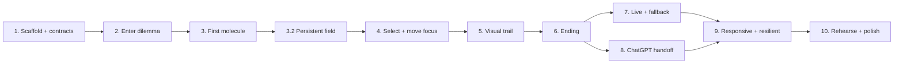

# Hmm… — Two-Day Build Plan

**Status:** Blocks 1–6 complete including Task 3.3 packed-soup substrate and Block 6.1 ending extension; Blocks 7–10 implemented for P0 (live API, resilient fallback, ChatGPT handoff, narrow/a11y polish, demo docs). Rehearse Task 10.1 before the event.

**Purpose:** Build the smallest complete, visually memorable session through demonstrable vertical slices.

**Depends on:** `01-product-and-mvp.md`, `02-experience-design.md`, `03-technical-design.md`, and `04-ai-contract.md`

## Priority language

- **P0 — required for the creature to exist.** The hackathon session is incomplete or unsafe without it.
- **P1 — makes us fall in love with it a little.** Attempt only after all P0 checks pass and the demo has been rehearsed.
- **P2 — nice to have, but it can sit and wait.** Explicitly unscheduled for the two-day build.

## Two-day feasibility check

The original plan budgets about 15 focused implementation hours plus roughly 2 hours of integration and rehearsal buffer. The persistent-cell revision replaces the current growing-node projection and is budgeted as a focused 2.5–3 hour correction, paid for by deferring all P1 motion flourishes until P0 is green. It assumes one implementation path, one curated demo, one generic fallback, and no design-system detour.

| Day | Blocks | Planned P0 time | End-of-day proof |
| --- | --- | ---: | --- |
| Day 1 | 1–5 | ~9.5 hours including the visual correction | A user can enter the demo dilemma, move through four rounds on one persistent cellular field, and see a coherent marked trail in forced mock mode. |
| Day 2 | 6–10 | ~7.5 hours | The trail reaches a summary, survives API failure, hands off to ChatGPT, works narrowly and by keyboard, and is ready to record. |

P1 work may use only remaining buffer after the entire P0 journey passes. P2 work is not started.

## Build rules

1. Every block leaves a visible, runnable increment.
2. Forced mock mode is built first and must remain green.
3. No task may add branching history, free positioning, persistence, or provider-specific state.
4. Layout and animation may be simplified before content, completion, security, or fallback behavior.
5. After each block, run its listed checks. At each day boundary, run the full `npm run check` and complete the mock journey manually.

---

## 1. Project scaffolding and tooling

### Task 1.1 — P0: Runnable, checked project shell ✅

**Implementation status:** Complete — 2026-07-20

**Observable outcome**

Opening the development URL shows a warm pearl canvas with the **Hmm…** wordmark and a small “Preparing the thought space…” placeholder. The repository has one lockfile and all standard commands work.

**Files likely to be affected**

- `package.json`, `package-lock.json`
- `index.html`
- `vite.config.ts`, `tsconfig*.json`, ESLint configuration
- `src/main.tsx`, `src/app/App.tsx`
- `src/styles/tokens.css`, `src/styles/global.css`
- `.gitignore`, `.env.example`

**Dependencies**

- None.

**Acceptance criteria**

- React, TypeScript, Vite, Motion, Zod, Vitest, and lint tooling are installed and locked.
- The commands in `AGENTS.md` exist; `dev:full` may initially proxy the same client until the function is added.
- TypeScript strict mode is enabled.
- `.env.local` and secret-bearing environment files are ignored.
- The placeholder renders without console errors.
- The base page already uses the agreed pearl, ink, violet, and amber tokens.

**Checks Codex must run**

- `npm install`
- `npm run lint`
- `npm run typecheck`
- `npm test`
- `npm run build`
- `npm run check`
- Start `npm run dev` and inspect the page and browser console.

### Task 1.2 — P0: Shared contracts and validated mock source ✅

**Implementation status:** Complete — 2026-07-20

**Observable outcome**

The app can load the curated `team-lead-demo` round and summary data through a `MockReflectionProvider`; fixture tests prove there are exactly three answers per round.

**Files likely to be affected**

- `shared/ai-contract.ts`, `shared/limits.ts`
- `src/content/mock-dataset.ts`
- `src/services/reflection-provider.ts`, `src/services/mock-provider.ts`
- contract and fixture test files

**Dependencies**

- Task 1.1.

**Acceptance criteria**

- Request, round, summary, and public-error Zod schemas match `04-ai-contract.md`.
- Answer collections use a three-item tuple or equivalent exact-length validation.
- Both curated and generic fixtures parse successfully.
- The provider exposes `getRound` and `getSummary` without network access.
- `VITE_CONTENT_MODE=mock` selects the mock provider.
- Invalid mock content fails a test rather than reaching the UI.

**Checks Codex must run**

- `npm test -- ai-contract mock-provider`
- `npm run typecheck`
- `npm run check`
- Run the client with `VITE_CONTENT_MODE=mock npm run dev` and confirm no `/api/reflect` request appears.

**Block 1 demonstration:** a branded shell boots, and the complete demo content contract is already available without an API.

---

## 2. Initial screen

### Task 2.1 — P0: Welcome, dilemma entry, and first mock round ✅

**Implementation status:** Complete — 2026-07-20

**Observable outcome**

A user opens the seed, enters the recommended dilemma, presses **Think it through**, sees the short generation state, and arrives at the first mock question.

**Files likely to be affected**

- `src/app/AppShell.tsx`
- `src/components/session/WelcomeSeed.tsx`
- `src/components/session/GenerationStatus.tsx`
- `src/session/session-types.ts`, `src/session/session-reducer.ts`
- welcome/session tests and relevant styles

**Dependencies**

- Tasks 1.1–1.2.

**Acceptance criteria**

- Welcome and entry copy matches `02-experience-design.md`.
- Empty or whitespace-only dilemmas cannot submit.
- The input accepts at most 400 characters and preserves the submitted wording.
- Submit is possible by button and documented keyboard behavior.
- Duplicate submission is blocked while generating.
- The first mock round is reached with no live API.
- Focus moves to the new question or an equivalent announcement is made.

**Checks Codex must run**

- Reducer tests for welcome → entering → generating → round-ready.
- Input validation and keyboard interaction tests.
- `npm run check`
- Manual mock-mode pass with empty, short, and near-limit inputs.

### Task 2.2 — P1: Seed-opening continuity

**Observable outcome**

The welcome seed expands into the input surface rather than swapping abruptly.

**Files likely to be affected**

- `WelcomeSeed.tsx`
- `motion.css` or component styles

**Dependencies**

- Task 2.1 and all P0 work through Block 10.

**Acceptance criteria**

- The transition lasts no more than 450 ms.
- Input focus lands after the expansion.
- Reduced-motion mode uses a short fade.

**Checks Codex must run**

- `npm run check`
- Manual default/reduced-motion comparison.

---

## 3. Static graph with one question and three answers

### Task 3.1 — P0: Legible first molecule ✅

**Implementation status:** Complete — 2026-07-20

**Observable outcome**

The submitted dilemma, first Hmm… question, exactly three suggestions, their relationships, and a stable **Your thread** progress card appear as a clear desktop composition.

**Files likely to be affected**

- `src/components/canvas/ThoughtCanvas.tsx`
- `src/components/canvas/ThoughtNode.tsx`
- `src/components/canvas/ConnectionLayer.tsx`
- `src/components/canvas/MembraneBackground.tsx`
- `src/components/session/AnswerCluster.tsx`
- `src/components/session/ProgressCard.tsx`
- `src/layout/projectCanvas.ts`, `src/layout/desktopLayout.ts`, `src/layout/curves.ts`
- `src/styles/canvas.css`

**Dependencies**

- Task 2.1.

**Acceptance criteria**

- The dilemma is amber and labelled **You brought**.
- The active question is the largest node, violet, and labelled **Hmm… asks**.
- Exactly three equal-weight neutral answer buttons appear in fixed non-overlapping slots.
- SVG connections are behind nodes and do not cross.
- Colour is reinforced by label, scale, border, and/or marker.
- Decorative cells are textless, non-interactive, and visually subordinate.
- **Your thread** shows the exact original dilemma, **0 of up to 5**, and **Starting out** without overlapping the graph.
- The card contains no certainty, confidence, clarity, or completion score.
- No graph library, random coordinates, confidence score, or pan/zoom behavior exists.

**Checks Codex must run**

- Pure layout tests for stable coordinates, unique IDs, and three suggestion nodes.
- Progress-card selector/component test for the initial state.
- Component test asserting exactly three answer buttons.
- `npm run check`
- Inspect at approximately 1440×900 and confirm no overlaps or crossed lines.

### Task 3.2 — P0: Persistent cellular field and occupancy model

**Implementation status:** Complete — 2026-07-20. The stable lattice extends beyond the viewport, each answer chooses the next route row, and the camera follows the active area without fitting the whole path.

**Observable outcome**

The canvas reads as one organic cellular world larger than the viewport. The first question and its three suggestions inhabit existing cells; later rounds move forward through that world along a route determined by the selected cell.

**Files likely to be affected**

- `src/components/canvas/ThoughtCanvas.tsx`
- new `src/components/canvas/CellField.tsx`, `Cell.tsx`, and `CellContent.tsx`, or equivalent focused replacements
- `src/components/canvas/ConnectionLayer.tsx`, `MembraneBackground.tsx`
- new `src/layout/cell-field.ts`, `projectOccupancy.ts`, or equivalent pure layout modules
- `src/layout/projectCanvas.ts`, layout tests, and `src/styles/canvas.css`

**Dependencies**

- Task 3.1 for the proven visual hierarchy.
- Existing session types and mock round contract; neither should change for this visual correction.

**Acceptance criteria**

- One finite preset lattice large enough for every five-round path is rendered for the session.
- Outer cell elements use stable slot IDs and keep the same count and relative geometry across round changes.
- Semantic question/answer IDs map into cells as occupancy; they are not React identities for the outer cells.
- The active question and exactly three suggestions occupy the next forward column at upper, middle, and lower rows with visible, uncrossed relationships.
- Choosing upper, middle, or lower changes the row of the next question and therefore the visible route.
- The camera advances toward the active question rather than fitting the full route into the viewport.
- Selected cells can retain text and a semantic mark; unchosen content can clear while its neutral cell remains.
- The progress-card exclusion area remains clear.
- There is no physics, random placement, procedural infinite grid, new cell geometry per round, or user-controlled pan/zoom.

**Checks Codex must run**

- Pure tests asserting stable cell IDs, count, geometry, legal occupancy, and no duplicate occupied slot.
- Component test rerendering consecutive rounds and asserting that outer cell elements retain identity.
- `npm run check`
- Inspect upper, middle, and lower choice paths at approximately 1440×900; verify that the same world pans to three different routes without a new cluster appearing.

### Task 3.3 — P0: Packed soup substrate

**Implementation status:** Complete — 2026-07-20. Hex-offset packing with diameter≈pitch makes empty neighbours appear to kiss; route IDs and camera behaviour unchanged.

**Observable outcome**

At approximately 1440×900 the empty cellular field reads as a packed soup: neighbouring quiet cells appear to touch or nearly touch. Questions and suggestions still occupy the same stable slots and choice-dependent routes; the denser pack makes options feel latent in the world rather than floating in a diagram grid.

**Files likely to be affected**

- `src/layout/cell-field.ts`, layout tests
- `src/components/canvas/CellField.tsx`
- `src/styles/canvas.css`
- `docs/01-product-and-mvp.md`, `docs/02-experience-design.md`, `docs/03-technical-design.md`

**Dependencies**

- Task 3.2.

**Acceptance criteria**

- Centres use a deterministic hex-offset lattice computed once as constants (no runtime physics).
- Empty-cell diameter is approximately the lattice pitch, with only a small membrane gap so neighbours kiss.
- Stable slot IDs, count, and relative geometry are preserved across rounds.
- Upper, middle, and lower choice sequences still produce distinct legal routes within the authored field.
- Occupied/active cells may scale slightly for emphasis; empty cells stay packed and visually subordinate.
- Progress-card exclusion area remains clear; narrow layout is unchanged.

**Checks Codex must run**

- Pure tests for neighbour distance ≈ pitch, stable IDs/count, and divergent routes.
- `npm run check`
- Manual inspect at approximately 1440×900 confirming the packed soup read.

---

## 4. Selection and transitions between simulated rounds

### Task 4.1 — P0: Complete mock interaction loop

**Implementation status:** Complete — 2026-07-20. Session guards, stable-cell selection transitions, and choice-dependent camera movement pass automated and browser checks.

**Observable outcome**

Selecting an answer marks its existing cell amber, clears the two unused possibility texts while leaving their cells in place, shows the transition whisper, and moves focus to the next mock question in an adjacent authored cell. This works through all five possible rounds.

**Files likely to be affected**

- `src/session/session-reducer.ts`, `session-selectors.ts`, `SessionContext.tsx`
- `ThoughtCanvas.tsx`, `CellField.tsx`, `CellContent.tsx`, `AnswerCluster.tsx`
- `src/styles/motion.css`
- reducer and interaction tests

**Dependencies**

- Tasks 3.1–3.2.

**Acceptance criteria**

- Only reducer events change phases.
- A selected answer commits once and is added to history once.
- Unselected content finishes clearing before the next round becomes interactive; its outer cells remain mounted and neutral.
- Selecting an answer never changes the stable cell count, slot IDs, or relative world geometry.
- The next question and suggestions occupy the forward lattice cells implied by the selected row, and the camera follows without appending a new bubble cluster.
- A new-round request begins when selection starts; the animation does not wait unnecessarily.
- The next question loads from `MockReflectionProvider`.
- After round 2, **I think I’ve got it** is available.
- After answer 5, the session routes toward summary generation.
- Each committed answer appears in **Your thread** exactly once and the qualitative status changes from the documented state rules.
- Reduced motion can complete the same state sequence without travel or pulsing.

**Checks Codex must run**

- Reducer tests for suggested selection, stale/duplicate events, early finish, and max-round finish.
- Interaction test for one full curated path.
- `npm run check`
- Manually complete all five rounds in mock mode and confirm there are never more than three suggestions.

### Task 4.2 — P0: Custom answer without a fourth suggestion ✅

**Implementation status:** Complete — 2026-07-20

**Observable outcome**

Choosing **None quite fit** opens **Say it your way**; a valid custom response becomes the selected amber answer and follows the same transition.

**Files likely to be affected**

- `src/components/session/CustomAnswerComposer.tsx`
- `AnswerCluster.tsx`
- reducer/types and custom-answer tests
- component styles

**Dependencies**

- Task 4.1.

**Acceptance criteria**

- **None quite fit** is a separate action, not a fourth suggestion node.
- Empty custom input is rejected with the documented copy.
- Input is limited to 160 characters.
- Cancel restores the three suggestions without losing the active question.
- Submit produces one history item with `answerSource: "custom"`.
- Desktop input is attached to the cluster; narrow behavior may temporarily use the same accessible inline form until Block 9.

**Checks Codex must run**

- Reducer and component tests for open, cancel, invalid, and submit paths.
- `npm run check`
- Manual keyboard-only custom-answer pass.

---

## 5. Visual history

### Task 5.1 — P0: Marked-cell trail and progress card that agree

**Implementation status:** Complete — 2026-07-20. Semantic history projects as marks and occupancy on the persistent field, and the progress card uses the same canonical history; desktop and narrow layouts have been inspected.

**Observable outcome**

After four selections, the initial dilemma and every selected question/answer pair remain marked in their original occupied cells as one continuous quieter trail, while **Your thread** lists the same committed answers in order and the current question remains dominant.

**Files likely to be affected**

- `src/session/session-selectors.ts`
- `src/layout/cell-field.ts`, `projectOccupancy.ts`, `desktopLayout.ts`, `curves.ts`
- `ThoughtCanvas.tsx`, `CellField.tsx`, `CellContent.tsx`, `ConnectionLayer.tsx`
- `ProgressCard.tsx`
- layout/selector tests and canvas styles

**Dependencies**

- Tasks 3.2 and 4.1–4.2.

**Acceptance criteria**

- Occupancy, marks, and edges are derived from dilemma, history, and current round; cell geometry is stable configuration and is not stored in session state.
- The trail alternates violet question and amber user answer.
- Desktop history uses the actual text-bearing dilemma, question, and selected-answer cells; a bead-only strip does not satisfy this task.
- Only chosen semantic content and marks persist; no dead suggestion content or branches remain, but all substrate cells persist.
- Recent history remains readable; older history scales/fades without breaking continuity.
- Stable cell IDs and deterministic world geometry produce the same field after rerender and after advancing rounds.
- Different `choiceIndex` sequences produce different marked cell routes; replaying the same sequence produces the same route.
- The active neighbourhood remains legible at the longest P0 history.
- The card is derived from canonical history and never stores its own copy.
- Its round count matches committed answers and it never displays the pressed-but-uncommitted answer.
- At the curated fourth answer it shows **A direction is forming** only when the held round has `suggestEnding: true`.
- No AI-generated or numeric certainty score exists.

**Checks Codex must run**

- Occupancy projection tests for 0–5 completed steps and no orphan/cross-linked edges.
- Determinism test: the same semantic state yields the same occupancy, and consecutive states preserve the cell-slot set and geometry.
- Progress-selector tests for 0–5 answers, custom answers, ending, and extension.
- `npm run check`
- Manual four-round demo at desktop width, confirming that the camera travels away from the origin and that different selections bend the route differently.

### Task 5.2 — P1: Progress-card trail review focus

**Implementation status:** Complete — 2026-07-20. Progress-card answer activation focuses the marked trail cell; Back to now restores active focus.

**Observable outcome**

Activating an item under **What you’ve chosen so far** pans the desktop camera (or scrolls the narrow thread) to that committed amber answer cell. **Back to now** or the next session advance restores the active neighbourhood. History is not edited.

**Files likely to be affected**

- `ProgressCard.tsx`, `ThoughtCanvas.tsx`, `EndingExperience.tsx`, `CellField.tsx`
- `cell-field.ts` / `projectCanvas.ts`, canvas styles, focused tests

**Acceptance criteria**

- Review focus is local presentation state, not reducer history.
- Focus target is the marked answer cell for that committed step.
- No free pan/zoom controls are introduced.
- Narrow layouts use scroll-into-view without stealing keyboard focus from controls unexpectedly.

**Checks Codex must run**

- Pure test mapping history index → answer cell ID.
- Component/interaction test for focus override and clear.
- `npm run check`

**Day 1 exit gate:** forced mock mode completes four selections on one persistent cellular field and shows a stable marked path. If this gate is not green, do not begin live API work.

---

## 6. Session ending and summary

### Task 6.1 — P0: Clarity prompt, result lens, restart, and one extension

**Implementation status:** Complete — 2026-07-20. Clarity prompt, early/suggested/max-round summaries, result lens, confirmed restart, and exactly one post-ending extension are implemented.

**Observable outcome**

After the curated fourth answer, **A direction is taking shape** appears. The user can reveal the four-part mock summary, start over, or explore exactly one remaining doubt and return to an updated ending.

**Files likely to be affected**

- `src/components/session/ClarityPrompt.tsx`, `SessionActions.tsx`
- `src/components/ending/ResultLens.tsx`
- reducer/context/provider integration
- ending layout and styles
- summary and finish-flow tests

**Dependencies**

- Task 5.1.

**Acceptance criteria**

- The curated round-5 payload is held while the clarity prompt is shown.
- **See what’s emerging** displays direction, 2–3 reasons, 1–2 doubts, and one next step.
- The result is tentative and contains no confidence score.
- **One more question** reveals the held fifth round.
- **Explore one remaining doubt** permits exactly one extension, then returns to summary.
- **Start over** confirms, clears in-memory state, and returns to welcome.
- The complete chosen trail remains marked on the same cellular field, visible but subordinate at the ending.
- **Your thread** remains visible with **Ready to reflect**, the original dilemma, and the ordered committed answers.

**Checks Codex must run**

- Reducer tests for user finish, suggested finish, max-round finish, extension, extension cap, and restart.
- Summary component tests for required section counts.
- `npm run check`
- Manual runs for finish after round 2, suggested finish after round 4, and forced finish after round 5.

---

## 7. API integration

### Task 7.1 — P0: Protected, validated live endpoint

**Implementation status:** Complete — 2026-07-20. `POST /api/reflect` validates input, calls OpenAI Structured Outputs server-side, re-validates output, and returns contract payloads or public errors with `no-store`.

**Observable outcome**

With server credentials configured, `POST /api/reflect` returns one validated live round or summary. With credentials absent, it returns a small public error and exposes no secret.

**Files likely to be affected**

- `api/reflect.ts`
- `shared/ai-contract.ts`, `shared/limits.ts`
- server prompt/config modules if needed
- `.env.example`, Vercel configuration if needed
- endpoint tests

**Dependencies**

- Task 1.2 and the exact contract in `04-ai-contract.md`.

**Acceptance criteria**

- Only POST with a valid `RoundRequest` or `SummaryRequest` is accepted.
- The system prompt remains server-side.
- The OpenAI SDK uses Structured Outputs and the selected shared schema.
- `OPENAI_API_KEY` and `OPENAI_MODEL` are read only server-side; no `VITE_` secret exists.
- Input, hard ending gates, output, and semantic rules are validated.
- Responses are `no-store`; provider internals and raw errors are not returned.
- Refusals map to a boundary result/error and never to casual generic reflection.
- No full dilemma or history is logged by default.

**Checks Codex must run**

- Endpoint tests for valid round, valid summary, wrong method, bad input, timeout, refusal, and invalid output.
- `npm run typecheck`
- `npm run check`
- Run `npm run dev:full`; exercise the endpoint with and without a local key.
- Build, then inspect `dist/` and browser network payloads for secrets.

### Task 7.2 — P0: Resilient live/mock provider

**Implementation status:** Complete — 2026-07-20. `VITE_CONTENT_MODE` selects mock/live/auto; auto falls back to mock with a recovery notice; refusals bypass generic fallback.

**Observable outcome**

`auto` mode uses live content when available and transparently returns validated generic mock content after timeout, network failure, rate limit, or invalid output without losing the path.

**Files likely to be affected**

- `src/services/live-provider.ts`, `resilient-provider.ts`
- provider selection in `App.tsx`
- `RecoveryNotice.tsx`
- provider/fallback tests

**Dependencies**

- Tasks 6.1 and 7.1.

**Acceptance criteria**

- `mock` makes no API request; `live` exposes failures; `auto` falls back.
- Live attempts stop at roughly seven seconds and are not automatically retried first.
- Restart or retry aborts/invalidates the previous request.
- Stale responses cannot overwrite a new session.
- The path remains intact and a quiet recovery notice appears.
- Summary failures preserve the trail and still produce a usable mock ending.
- Sensitive/refusal responses bypass generic fallback.

**Checks Codex must run**

- Provider tests for mode selection, timeout, network error, invalid schema, stale response, summary fallback, and refusal bypass.
- `npm run check`
- Complete the demo once live, once with the endpoint disabled, and once with forced mock mode.

---

## 8. Continue in ChatGPT

### Task 8.1 — P0: Deterministic context handoff

**Implementation status:** Complete — 2026-07-20. Ending **Continue in ChatGPT** builds a local prompt, copies it, opens ChatGPT, and falls back to a manual-copy textarea.

**Observable outcome**

From the ending, **Continue in ChatGPT** copies a complete context prompt, opens ChatGPT, and tells the user to paste. If browser permissions fail, the prompt remains available for manual copying.

**Files likely to be affected**

- `src/utils/chatgpt-handoff.ts`
- `ResultLens.tsx`
- handoff tests and feedback styles

**Dependencies**

- Task 6.1.

**Acceptance criteria**

- Prompt includes the exact dilemma, every selected question/answer pair, direction, reasons, doubts, next step, and non-decision instruction.
- Prompt construction is local and deterministic; it makes no model call.
- The new tab is opened synchronously from the user action to reduce popup blocking.
- Clipboard success produces the documented confirmation.
- Clipboard/tab failure reveals the same prompt for manual copy.
- No attempt is made to inject text automatically into ChatGPT.

**Checks Codex must run**

- Unit tests for prompt content, ordering, custom answers, and special characters.
- Component tests for success and failure states.
- `npm run check`
- Manual clipboard/new-tab test in the demo browser.

### Task 8.2 — P1: Independent summary copy

**Observable outcome**

The user can copy the concise result without opening ChatGPT.

**Files likely to be affected**

- `ResultLens.tsx`, `chatgpt-handoff.ts`

**Dependencies**

- Task 8.1 and all P0 work through Block 10.

**Acceptance criteria**

- The action is visually secondary.
- Copied content contains the four summary sections but not the full ChatGPT instruction.
- Failure uses the existing manual-copy path.

**Checks Codex must run**

- Handoff utility/component tests.
- `npm run check`

---

## 9. Responsive design, accessibility, and error handling

### Task 9.1 — P0: Narrow vertical thread and resilient interaction

**Implementation status:** Complete — 2026-07-20 for P0 essentials. Narrow CSS thread, progress disclosure, 16px body text, recovery/boundary notices, and reduced-motion kill-switch are in place. Further trail-strip refinement remains P1.

**Observable outcome**

At a narrow viewport the current question and three answers become a readable vertical thread, the history becomes a compact strip, the custom editor works above the keyboard, and error/recovery states preserve context.

**Files likely to be affected**

- `src/layout/narrowLayout.ts`
- canvas/session/ending components
- `RecoveryNotice.tsx`
- responsive, focus, and reduced-motion styles
- accessibility/responsive tests

**Dependencies**

- Tasks 5.1–8.1.

**Acceptance criteria**

- Desktop layout switches to a purpose-built narrow layout around the crowding breakpoint.
- The progress card becomes an accessible disclosure whose status row remains visible and which opens automatically at the ending.
- Body text is at least 16 px and touch targets at least 44 px.
- Suggestions stack in a stable reading order and connectors do not cross.
- Active history scrolls into view without stealing focus.
- Custom input is usable with the software keyboard.
- All primary actions work by keyboard with visible focus.
- State changes and errors are announced in a restrained live region.
- Reduced motion removes large travel, blur, morph, and continuous pulsing.
- Error, retry, and mock-fallback notices never replace the existing path.
- The full mock session works at both desktop and narrow widths.

**Checks Codex must run**

- Layout tests around both sides of the breakpoint.
- Keyboard and accessible-name component tests.
- Reduced-motion behavior tests where practical.
- `npm run check`
- Manual pass at roughly 1440×900 and 390×844, including custom input, ending, and an injected API failure.

### Task 9.2 — P1: Refined narrow trail navigation

**Observable outcome**

The narrow history strip smoothly keeps the active end visible and allows old node text to be inspected without becoming editable.

**Files likely to be affected**

- narrow trail component/layout and motion styles

**Dependencies**

- Task 9.1 and all P0 work through Block 10.

**Acceptance criteria**

- Auto-scroll does not move keyboard focus.
- Focus/hover can reveal condensed old labels.
- Reduced motion scrolls instantly.

**Checks Codex must run**

- Focus and scroll behavior tests.
- `npm run check`
- Manual keyboard and touch-size inspection.

---

## 10. Demo polish

### Task 10.1 — P0: Rehearsed, stable 90-second demo

**Implementation status:** Ready for rehearsal — 2026-07-20. Forced mock mode, README demo steps, and `npm run check` are green; complete three timed rehearsals before the event.

**Observable outcome**

A presenter can open a deterministic demo URL, enter or preload the recommended scenario, complete four selections, reveal the summary, and trigger the ChatGPT handoff in under 90 seconds without network dependence.

**Files likely to be affected**

- visual tokens and motion timing files
- provider selection/demo query handling
- mock content only if it conflicts with the approved contract
- `README.md` for run/demo instructions
- small fixes across existing components

**Dependencies**

- All P0 tasks in Blocks 1–9.

**Acceptance criteria**

- A documented forced-demo URL or environment mode always selects the curated fixture.
- The demo makes no live request and cannot be derailed by API state.
- Essential transition durations stay within the experience specification.
- No console errors, clipped controls, duplicate answers, focus traps, dead branches, or visible layout jumps occur.
- The reference-informed pearl/violet/amber visual hierarchy is clear without narration.
- The progress card gives the presenter and viewer a stable textual anchor without competing with the active question.
- Production build loads and completes the session.
- A cold run and three consecutive rehearsals complete successfully in under 90 seconds.

**Checks Codex must run**

- `npm run check`
- `npm run build` and `npm run preview`
- Complete forced mock, automatic fallback, and live smoke sessions.
- Inspect desktop, narrow, keyboard-only, and reduced-motion modes.
- Inspect browser console and network panel.
- Search the built client for secret patterns and server-only environment names.
- Time three complete curated rehearsals.

### Task 10.2 — P1: One restrained layer of delight

**Observable outcome**

One optional visual flourish—such as a sub-4 px membrane drift, one connector glint, or one ending ripple—adds life without obscuring content or risking the demo.

**Files likely to be affected**

- `MembraneBackground.tsx`
- `motion.css`, `canvas.css`

**Dependencies**

- Task 10.1 complete with remaining time.

**Acceptance criteria**

- Implement only one flourish, chosen after watching the completed session.
- It uses transform/opacity only, stops or disappears in reduced motion, and introduces no interaction.
- It causes no obvious frame drops or distraction.

**Checks Codex must run**

- `npm run check`
- Default/reduced-motion visual comparison.
- Re-run the 90-second rehearsal once.

---

## P2 — explicitly waiting outside the two-day build

These are not scheduled tasks and should not receive scaffolding “just in case”:

- session restoration or saved decisions;
- additional curated scenarios beyond the one demo and generic fallback;
- analytics or experimentation infrastructure;
- numeric certainty, confidence, clarity, completion, or decision-quality scoring;
- a visible live/mock/model selector;
- editable history, undo, branch comparison, arbitrary graphs, or draggable nodes;
- advanced membrane generation, physics, WebGL, particles, or 3D;
- procedural or infinite cell fields and new cell geometry generated per round;
- authentication, database, collaboration, localization, voice, or notifications;
- a broad end-to-end testing framework beyond the focused P0 test suite;
- production-grade rate-limiting infrastructure beyond platform controls and spend limits.

## Critical dependency path

The API is intentionally late. Blocks 1–6 must produce a complete creature in mock mode before live generation can threaten the schedule.

## Final P0 release gate

P0 is complete only when:

- `npm run check` passes;
- forced mock mode completes the curated journey without a network request;
- automatic mode survives a disabled API and still reaches the ending;
- the live endpoint works when configured and no secret reaches the client;
- exactly three suggestions appear in every round;
- the same preset cell lattice remains mounted while the camera follows the active area; content occupancy changes without new bubble clusters;
- different upper/middle/lower selection sequences visibly produce different paths through the field;
- the progress card always matches the exact original dilemma and committed answer history, including at the ending;
- custom answer, early finish, suggested finish, max-round finish, restart, and one extension work;
- the result always contains direction, reasons, doubts, and next step;
- ChatGPT handoff copies the complete deterministic context;
- desktop, narrow, keyboard, and reduced-motion passes succeed;
- three consecutive 90-second demo rehearsals complete without intervention.
